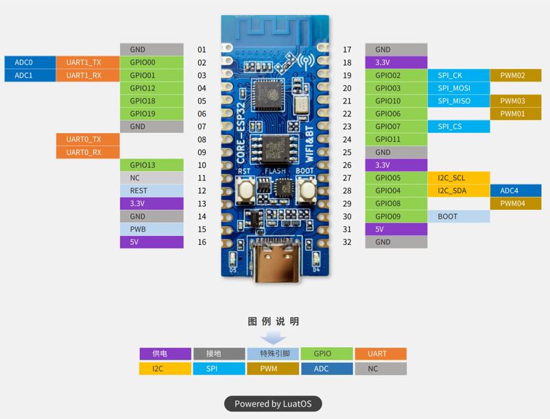

# ESP32-C3 BSP 说明

## 简介

本文档为 乐鑫ESP32-C3 开发板的[ESP32C3](http://luatos.com/t/esp32c3) BSP (板级支持包) 说明。

主要内容如下：

- 开发板资源介绍
- BSP 快速上手

通过阅读快速上手章节开发者可以快速地上手该 BSP，将 RT-Thread 运行在开发板上。

## 开发板介绍

目前测试了两款开发板，运行都正常，由于两款开发板LED小灯引脚不同，请根据自己开发板修改GPIO引脚，目前默认使用的开发板是LUATOS_ESP32C3。已测开发板外观如下图所示：

- [LUATOS_ESP32C3](https://wiki.luatos.com/chips/esp32c3/board.html)

- [HX-DK-商](https://docs.wireless-tech.cn/doc/7/)

该开发板常用 **板载资源** 如下：

- MCU：[esp32-c3](https://www.espressif.com/sites/default/files/documentation/esp32-c3_datasheet_en.pdf)，主频  160MHz， 407.22 CoreMark; 2.55  CoreMark/MHz
- 芯片内置：384KB ROM,  400KB SRAM,
- 常用外设
  - 红色LED：2个，D4 (IO12), D5（IO13）
  - 按键：2个，K1（BOOT） K2(RST)
  - SPI FLASH: 2M 
- 常用接口：USB UART等

开发板更多详细信息请参考 [ESP32-C3开发板介绍](https://wiki.luatos.com/chips/esp32c3/board.html)。

## 外设支持

本 BSP 目前对外设的支持情况如下：

| **片上外设**      | **支持情况** | **备注**                              |
| :----------------- | :----------: | :------------------------------------- |
| GPIO              |     待支持     |  |
| UART              |     待支持     |                                 |

## 使用说明

使用说明分为如下两个章节：

- VSCODE-IDF tool 快速搭建

    本章节是如何为快速搭建ESP-IDF的开发环境。

- 编译

    这里会演示如何编译ESP32-C3。

### 快速上手

IDF的搭建方法有很多种，尝试了很多种方法之后，总结了一个最快速的方法，非常简单方便，具体方法见链接[ESP-IDF 一键式搭建环境基于VSCODE](https://blog.csdn.net/lt6210925/article/details/123699249)。 安装的时候请选择IDF 4.4版本

### IDF patch加载

由于IDF使用的是FREERTOS需要修改一些文件，将`0001-add-fixed-of-rtthread.patch` 这个文件拷贝到安装的时候的IDF的代码目录，执行命令 `git apply 0001-add-fixed-of-rtthread.patch` 打上patch

#### 编译下载

编译选择最下面的按钮：

这边通常采用串口下载，需要根据你自己开发板选择对应的串口

#### 运行结果

下载程序成功之后，系统会运行，红色的 D4以 1S 周期闪烁。
刚接触ESP32, 目前仅实现LED小灯闪烁，可以print打印，后续计划将pin设备和console对接上去，也欢迎大家一起来贡献，感兴趣的可以通过公众号`Thomas的小火车`来联系

## 注意事项

- 目前RTTHREAD支持起来了，后续会需要继续完善一些其他功能，刚开始使用ESP32，欢迎小伙伴一起来讨论和贡献。

## 联系人信息

维护人:

-  [supperthomas] 邮箱：<78900636@qq.com>