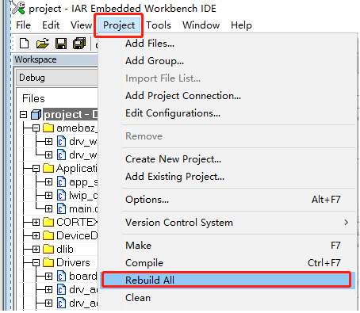
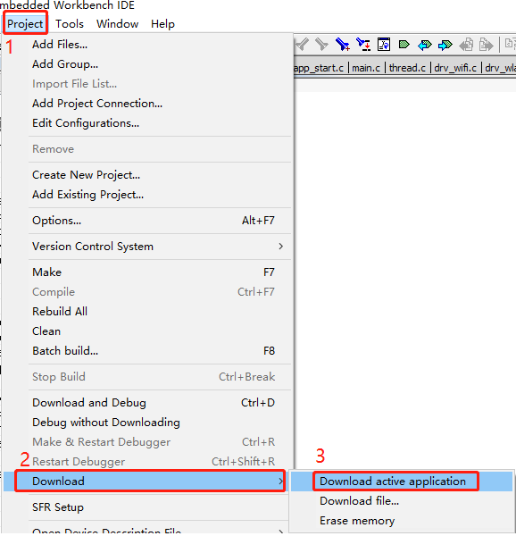
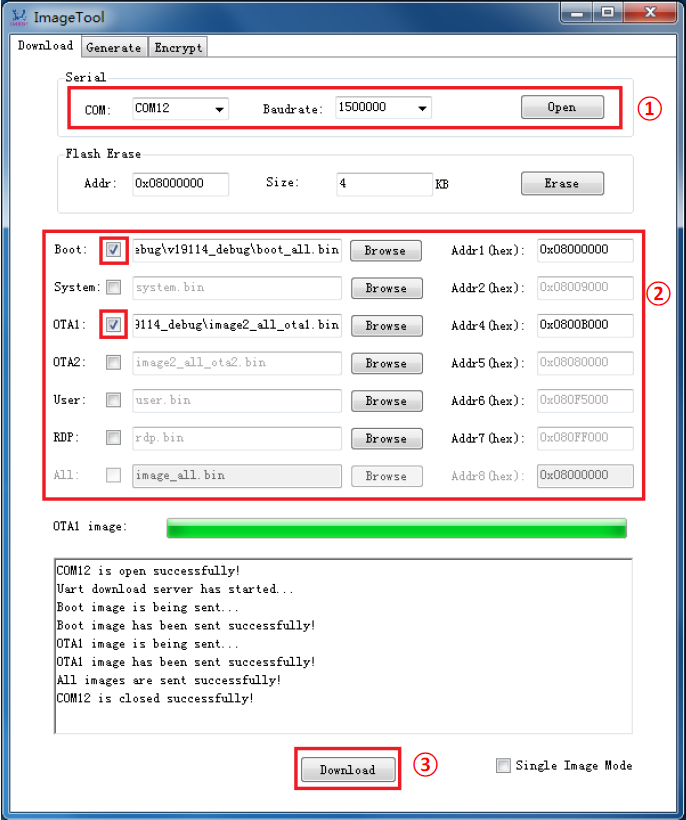

# amebaz on RT-Thread

## 1 简介

amebaz 是由Realtek推出的Cortex-M4内核的WiFi SOC芯片，属于rtl8710b系列。硬件特性如下：

| 硬件 | 描述 |
| -- | -- |
|芯片型号| amebaz |
|CPU| Cortex-M4 |
|主频| 125MHz |

## 2 编译说明

| 环境         | 说明                                                         |
| ------------ | ------------------------------------------------------------ |
| PC操作系统   | Linux/MacOS/Windows                                          |
| 编译器       | arm-none-eabi-gcc version 6.3.1 20170620 (release) |
| 构建工具     | scons                                               |
| 依赖软件环境 | Env工具/(IAR或arm-none-eabi-gcc)/git/调试器驱动         |

## 3 下载源码

```bash
    git clone https://github.com/RT-Thread/rt-thread.git
```

## 4 环境准备

### 4.1 Windows 环境准备

Windows环境下有两种开发环境，`GCC toolchain` 和 `IAR IDE`，根据不同的需求自行选择。

#### 4.1.1 IAR 发开环境

IAR 开发环境需要开发者自己安装软件，安装过程这里就不特别说明了。amebaz工程当前仅支持 `IAR 7.X` 的版本。

#### 4.4.2 GCC 开发环境

GCC开发使用 RT-Thread 官方提供的 env 工具，该工具集成 GCC 工具链，还具有编译构建环境、图形化系统配置及软件包管理功能。

下载地址：[点击下载env工具](https://www.rt-thread.org/download.html#download-rt-thread-env-tool)

第一次使用env工具的开发者可以去这里查看教程：[RT-Thread env 工具用户手册](https://www.rt-thread.org/document/site/rtthread-development-guide/rtthread-tool-manual/env/env-user-manual/)。

### 4.2 Linux/Mac 环境准备

Linux/Mac 仅支持 GCC 工具链。

```bash
    cd rt-thread/bsp/amebaz
    scons --menuconfig
    source ~/.env/env.sh
    pkgs --upgrade
```

## 5 配置工程（可选）

### 5.1 Windows 配置工程

配置工程，需要在相应的工程目录下使用 `menuconfig` 命令打开图形界面，开发者根据自己的需求开关功能组件。

```bash
    menuconfig
```

### 5.2 Linux/Mac 配置工程

（Linux/Mac）

```bash
    scons --menuconfig
```

## 6 更新软件包

amebaz 配套的驱动库以 package 形式提供，故需先下载对应的 package(realtek-ameba)，在工程目录下，使用下面命令下载软件包。

```bash
    pkgs --update
```

## 7 编译

### 7.1 Windows 编译工程

#### 7.1.1 IAR 编译工程

先打开工程目录下的IAR工程（project.eww），然后单击 Project 选项卡，单击 Rebuild All 选项，进行编译



#### 7.1.2 GCC 编译工程

可以使用env编译工程，无需设置GCC工具链路径，直接在 rt-thread/bsp/amebaz 工程目录下输入 `scons` 编译即可。编译完成后，在工程目录下生成 `image2_all_ota1.bin` 文件。

```bash
    scons
```

### 7.2 Linux/Mac 编译工程

如果没有配置GCC路径的环境变量，则需要使用以下指令设置gcc路径。

```bash
    export RTT_EXEC_PATH=[GCC路径]
```

设置 GCC 路径后，使用 `scons` 编译工程。

```bash
    scons
```

或者通过 `scons --exec-path="GCC工具链路径"` 命令，在指定工具链位置的同时直接编译。

出现下列信息即为编译成功

```bash
LINK rtthread.axf
arm-none-eabi-objcopy -j .ram_image2.entry -j .ram_image2.data -j .ram_image2.bss -j .ram_image2.skb.bss -j .ram_heap.data -Obinary rtthread.axf ram_2.r.bin
arm-none-eabi-objcopy -j .xip_image2.text -Obinary rtthread.axf xip_image2.bin
arm-none-eabi-objcopy -j .ram_rdp.text -Obinary rtthread.axf rdp.bin
python gen_bin.py
is_law = 1
start = 10005000, end = 0, base = 10000000
Input file size: 65852
copy size 45372
start = 10005000, end = 0, base = 10000000
Input file size: 45372
copy size 24892
start = 0, end = 0, base = 0
Input file size: 336816
copy size 336816
size = 361772
checksum 209b36c
'true' is not recognized as an internal or external command,
operable program or batch file.
Done...
scons: done building targets.
```

如果编译正确无误，会在工程目录下生成 image2_all_ota1.bin 文件。

## 8 烧写及执行

### 8.1 IAR下载

下载程序分为两部分：

（a）先使用jlink工具正确连接A14(CLK),A15(TMS),GND,VCC引脚

（b）打开 IAR 工程并完成编译后，单击 Project 选项卡下 Download 选项，选择 Download active application 下载程序。



（c）短按复位按钮，连接串口查看调试信息

### 8.2 串口下载

串口下载分为三个步骤

（a）板子进入下载模式

板子使用 `micros usb` 上电，然后按住 `FLASH` 键不放手，短按 `RST` 键，松开 `RST` 和 `FLASH` 键进入下载模式。

（b）配置下载工具

打开 Image Tool 下载工具配置使用，选择 `micros usb` 所对应的串口端口，选择波特率，默认波特率 1.5Mbps，然后打开串口端口，如下载工具图“①”所示



boot选择工程提供的 `boot_all.bin`, OTA1 选择生成的 image2_all_ota1.bin 文件（通常在工程目录下），并且注意在这两个选项前面打勾确认，其他默认即可，如下载工具图“②”。

（c）下载程序

按下 Download（如下载工具图 “③”），即可开始下载程序，并且可以从日志窗口查看到下载信息。

## 9 运行

下载程序后，连接串口（默认使用板子上 `micro usb`），打开串口工具，配置串口波特率 115200，数据位 8 位，停止位 1 位，无校验，无流控；短按 `RST` 键复位，串口将输出调试信息，如下所示：

```bash
 \ | /
- RT -     Thread Operating System
 / | \     3.1.1 build Oct 25 2018
 2006 - 2018 Copyright by rt-thread team
lwIP-2.0.2 initialized!

Initializing WIFI ...
LDO Mode, BD_Info: 0

LDO Mode, BD_Info: 0

WIFI initialized
[I/WIFI] amebaz_wifi_start success
build time: Oct 25 2018 10:52:02
Hello RT-Thread!
[I/WLAN.dev] wlan init success
[I/WLAN.lwip] eth device init ok name:w0
msh >
```

## 10 WIFI简单使用

### wifi扫描命令

wifi 扫描命令格式如下

```bash
    wifi scan
```

命令说明  

| 字段 | 描述                     |
| ---- | ------------------------ |
| wifi | 有关wifi命令都以wifi开头 |
| scan | wifi执行扫描动作         |

在调试工具中输入该命令，即可进行 wifi 命令扫描，调试信息如下

```bash
scan ap down
             SSID                      MAC              security    rssi   chn    Mbps
------------------------------- -----------------    -------------- ----   ---    ----
NEO-shanghai-ap2                58:66:ba:a1:ee:71    WPA2_TKIP_PSK   -74    11    0
WQ1                             88:25:93:94:51:54    WPA2_AES_PSK    -76    13    0
shyc1                           a0:40:a0:a3:e8:c9    WPA2_AES_PSK    -77    13    0
KVIP                            70:65:82:3b:71:43    WPA2_AES_PSK    -83    11    0
YST2016                         88:25:93:c6:67:d1    WPA2_TKIP_PSK   -84     4    0
```

> 注：wifi 有关的命令，均以wifi开头。

### wifi 接入

接入 wifi 之前，先介绍一下其接入的命令 ，如下

```bash
    wifi join ssid 123456789
```

命令说明

| 字段      | 描述                               |
| --------- | ---------------------------------- |
| wifi      | 有关wifi命令都以wifi开头           |
| join      | wifi执行连接动作                   |
| ssid      | 热点的名字                         |
| 123456789 | 热点的密码，没有密码可不输入这一项 |

了解上述命令，并且成功完成前面步骤，在串口中输入 `wifi w0 join realthread_VIP 123456789` ，如下日志表示连接成功

```bash

WIFI  wlan0 Setting:
==============================
      MODE => STATION
      SSID => realthread_VIP
   CHANNEL => 6
  SECURITY => AES
  PASSWORD => 123456789
[I/WLAN.mgnt] wifi connect success ssid:realthread_VIP

```

另外，提供一个简单的测试使用命令，查询设备IP地址命令：ifconfig。

```bash
network interface: w0 (Default)
MTU: 1500
MAC: 00 e0 4c d5 ac 46
FLAGS: UP LINK_UP ETHARP BROADCAST
ip address: 172.16.200.110
gw address: 172.16.200.1
net mask  : 255.255.255.0
dns server #0: 172.16.200.1
dns server #1: 223.5.5.5
```

## 驱动支持情况及计划

| 驱动       | 支持情况 | 备注                         |
| ---------- | :------: | :--------------------------: |
| UART       | 支持     | UART0                        |
| WLAN       | 部分支持 | 仅支持STA模式                |

## 联系人信息

维护人:
[flyingcys][4] < [flyingcys@163.com][5] >

  [1]: https://www.rt-thread.org/download.html#download-rt-thread-env-tool
  [4]: https://github.com/flyingcys
  [5]: mailto:flyingcys@163.com
