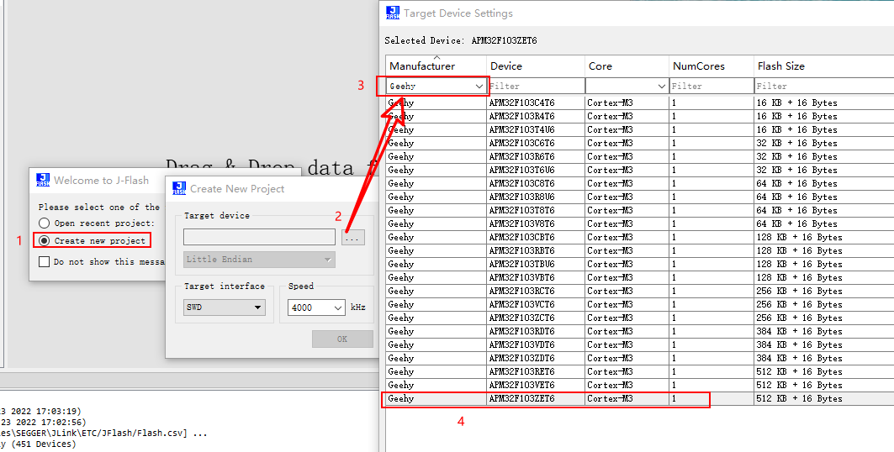
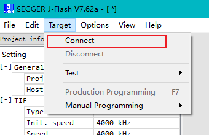
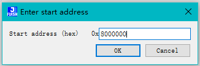
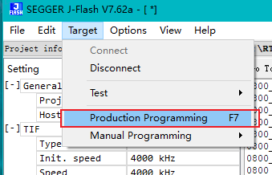

# APM32F107VC EVAL BOARD BSP 说明

## 简介

本文档为 APM32F107 EVAL开发板（EVAL BOARD）的 BSP (板级支持包) 说明。

主要内容如下：

- 开发板资源介绍
- BSP 快速上手

通过阅读快速上手章节开发者可以快速地上手该 BSP，将 RT-Thread 运行在开发板上。

## 开发板介绍

APM32F107 EVAL BOARD，采用标准JTAG/SWD调试接口，引出了大部分的IO。开发板外观如下图所示：


- 有关开发板和芯片的详情可至极海官网查阅。[官网开发板链接 ](https://www.geehy.com/support/apm32?id=192)


该开发板常用 **板载资源** 如下：

- MCU：APM32F107VCT6，主频 72MHz，256KB FLASH ，64KB RAM
- 外部 RAM：无
- 外部 FLASH：W25Q16（SPI, 16M bit）
- 常用外设
  - LED：3个，（红色，PE7/PE8/PE9）
  - 按键：3个，K1（PE10），K2（PC0）K3（PE12）
- 常用接口：USB转串口、以太网接口、SPI LCD接口、USB OTG
- 调试接口：标准 JTAG/SWD

## 外设支持

本 BSP 目前对外设的支持情况如下：

| **板载外设** | **支持情况** | **备注**                             |
| :----------- | :----------: | :------------------------------------ |
| USB转USART串口 |     支持     | 使用 UART4      |
| SPI Flash | 支持 | W25Q16 |
| EEPROM | 支持 | 软件i2c1 |
| 以太网 | 支持 | PHY: DP83848, RMII 接口 |
| **片上外设** | **支持情况** | **备注**                             |
| GPIO         |     支持     | PA0, PA1... PG15 ---> PIN: 0, 1...108 |
| UART         |     支持     | UART1/2/3/4                           |
| ADC          |     支持     | ADC1/2                              |
| DAC          |     支持     | DAC1                                  |
| RTC          |     支持     | 支持外部晶振和内部低速时钟            |
| TMR          |     支持     | TMR1/2/3/4/5/6/7                    |
| PWM          |     支持     | TMR3 ->CH1/2/3/4                      |
| I2C          |     支持     | 软件I2C                               |
| SPI          |     支持     | SPI1/2/3                              |
| WDT          |     支持     | IWDT                                  |

## 使用说明

本章节是为刚接触 RT-Thread 的新手准备的使用说明，遵循简单的步骤即可将 RT-Thread 操作系统运行在该开发板上，看到实验效果 。


### 快速上手

本 BSP 为开发者提供MDK5 工程。下面以 MDK5 开发环境为例，介绍如何将系统运行起来。

#### 硬件连接

使用数据线连接开发板到 PC，打开电源开关。

#### 编译下载
- 方式一：MDK

   双击 project.uvprojx 文件，打开 MDK5 工程，编译并下载程序到开发板。

> 工程默认配置使用 J-Link 仿真器下载程序，在通过 J-Link 连接开发板的基础上，点击下载按钮即可下载程序到开发板

- 方式二：J-Flash下载

  通过ENV工具的scons指令或MDK编译出bin文件后，再使用J-Flash工具将bin文件下载至开发板即可，大致步骤如下：

##### 1、建立J-Flash工程



**注意**：步骤4选择芯片型号时，要根据自己的开发板所用的芯片型号进行选择。比如本开发板，则选择对应的 **APM32F107VCT6** 。

##### 2、连接开发板


##### 3、将bin文件拖至工程，起始地址设为0x8000000

##### 4、点击下载


#### 运行结果

下载程序成功之后，系统会自动运行，LED 闪烁

连接开发板对应串口到 PC , 在终端工具里打开相应的串口（115200-8-1-N），复位设备后，可以看到 RT-Thread 的输出信息:

```bash
 \ | /
- RT -     Thread Operating System
 / | \     4.1.0 build Aug 20 2021
 2006 - 2021 Copyright by rt-thread team
msh >
```
## 注意事项

- 可在极海官方网站进行所需资料下载，如pack安装包和对应开发板原理图等（www.geehy.com）。

## 联系人信息

-[abbbcc ](https://gitee.com/abbbcc)

-[stevetong459 ](https://github.com/stevetong459)

-[luobeihai](https://github.com/luobeihai)