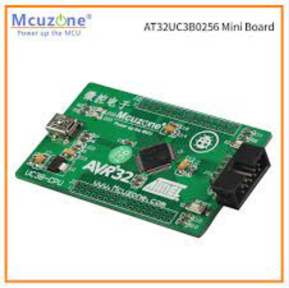

# MCUZone AT32UC3B0256 mini development board

## Introduction

**The AVR32 is a high performance, low power 32-bit Atmel AVR
microcontroller.** This board support package supports the MCUZone
AVR32 mini development board (also known as the AVR32DEV1). The
development board uses the AT32UC3B0256 microcontroller.



Note: Unfortunately, the online link for the development board (both
MCUZone OR Aliexpress) doesn't work. I don't have access to the
schematic (OR Gerber information) for this development kit. I used a
multimeter to look for the connected pins. If you - the reader - do
have access to the schematic/pinouts, could you please reach out to
me?

This README is essentially a work-in-progress. I will try to map the
berg rows (J1 and J2) and document them as and when I further the
device driver base for the target.

If you feel like reaching out to me for questions pertaining to the
target development board, you can write to me: ramangopalan AT gmail
dot com.

## Supported compiler

This BSP is built with the AVR32 GCC that comes with the Microchip
Studio. I am using the Microchip Studio version 7.0.2594. Make sure
that avr32-gcc.exe is visible on your command line. Add the binary
directory to you PATH. Yes, on Windows. Sorry :(


I use Git Bash (Windows) for compiling the RT-Thread system. Once you
set your path correctly, invoke Git Bash to query avr32-gcc.exe's
version. The output should look similar to this:

```bash
$ avr32-gcc.exe --version
avr32-gcc.exe (AVR_32_bit_GNU_Toolchain_3.4.2_435) 4.4.7
Copyright (C) 2010 Free Software Foundation, Inc.
This is free software; see the source for copying conditions.  There is NO
warranty; not even for MERCHANTABILITY or FITNESS FOR A PARTICULAR PURPOSE.
```

If you see this, you're all set to compile RT-Thread for AT32UC3B0256.

## Program firmware

### Step 1: download the RT-Thread codebase and navigate to bsp/avr32uc3b0.

```bash
$ cd bsp/avr32uc3b0/
```

### Step 2: build

```bash
scons -c
scons
```

### Step 3: flash

If everything went well, scons should have generated an elf file:
rtthread-uc3b0256.elf. Let us program the file. The program `atprogram'
comes with Microchip Studio. I didn't have to do much here. Just make sure
`atprogram.exe' is in your PATH.

```bash
atprogram -t atmelice -i jtag -d at32uc3b0256 program -f rtthread-uc3b0256.elf
```

Note that you should already see the on-board LEDs (PA7, PA8) blink if your
programming was successful. I use the Atmel ICE programmer. To access
msh, you'll need an FTDI breakout board. Connect the target board to
the FTDI breakout with jumper wires:

- GND (FTDI) to GND (development board)
- RX (FTDI) to J2, pin 10.
- TX (FTDI) to J2, pin 7.

## Running Result

The output information on serial port for `ps' the command should look like this:

```bash
0x000003c0 tidle0    31  ready   0x00000054 0x00000100    67%   0x00000009 OK
0x00001650 tshell    20  running 0x000000b4 0x00001000    13%   0x0000000a OK
0x00000ac4 led2       5  suspend 0x0000007c 0x00000400    12%   0x0000000a EINTRPT
0x00001350 led1       5  suspend 0x0000007c 0x00000400    12%   0x00000005 EINTRPT
```

## Peripheral Support

| Drive | Support | Remark  |
| ----- | ------- | ------- |
| UART  | Support | UART0/1 |
| GPIO  | -       | -       |
| I2C   | -       | -       |
| RTC   | -       | -       |
| SPI   | -       | -       |
| TIMER | -       | -       |
| WDT   | -       | -       |

