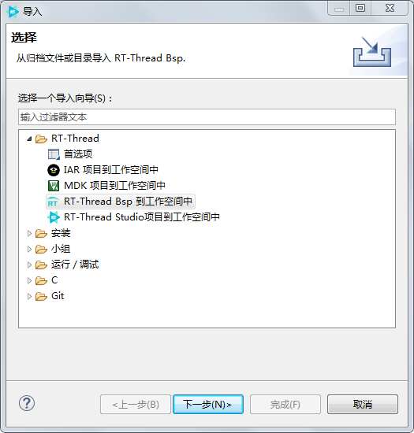
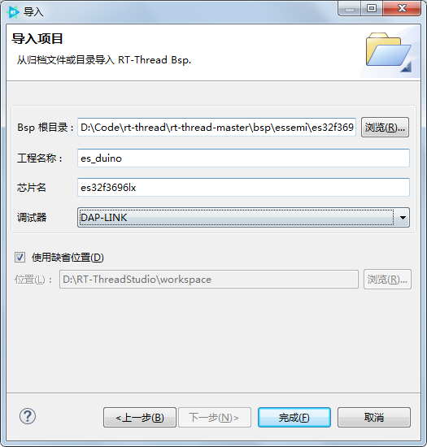
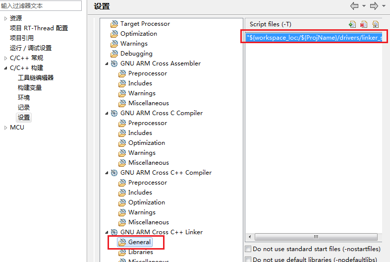
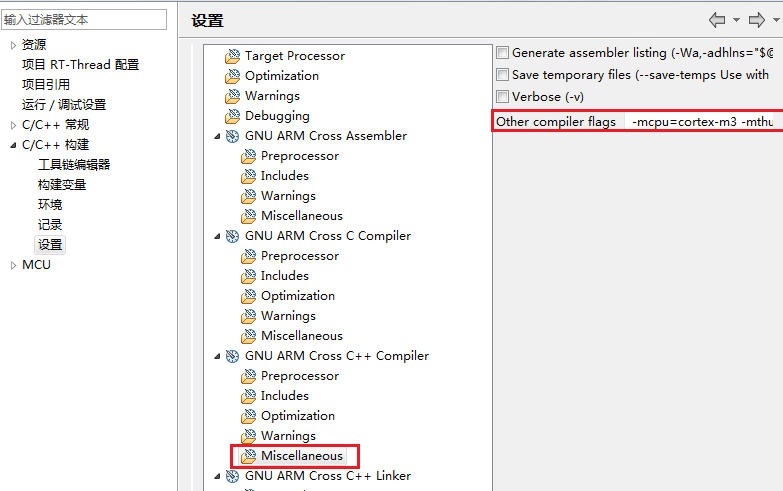

# ES32F3696的Arduino生态兼容说明

## 1 RTduino - RT-Thread的Arduino生态兼容层

ES32F3696已经适配了[RTduino软件包](https://github.com/RTduino/RTduino)，可正常使用全部功能，包含GPIO/PWM及I2C/SPI通信接口。除标准arduino uno的接口外，该开发板还额外添加了4个led和一个方向键对应的GPIO，方便使用。更多信息，请参见[RTduino软件包说明文档](https://github.com/RTduino/RTduino)

### 1.1 使用Keil+Env

1. Env 工具下敲入 menuconfig 命令，或者 RT-Thread Studio IDE 下选择 RT-Thread Settings：

```Kconfig
Hardware Drivers Config --->
    Onboard Peripheral Drivers --->
        [*] Compatible with Arduino Ecosystem (RTduino)
```

2. 进入RTduino配置，打开需要使用的各项配置 (SPI,I2C,Adafrui等)

```Kconfig
RT-Thread online packages --->
    system packages --->
        RTduino: Arduino Ecological Compatibility Layer
```

3. 使用 pkgs --update下载RTduino包
4. 使用scons --target=mdk5生成代码

### 1.2 使用RT-Thread Studio

1. 选择 文件 -> 导入 -> BSP导入

   

2. 选择es32f369x的bsp路径，并填写工程名称、芯片名(es32f3696lx)

   

3. 打开RT-Thread Settings，选择硬件，开启RTduino支持

   

   保存后稍等片刻，等待Studio下载库并完成配置

* 可能遇到的问题与解决方案

1. Unknown flag "-T"

   项目->属性->C/C++构建->GNU ARM Cross C++ Linker -> General在右侧添加lds连接脚本`"${workspace_loc:/${ProjName}/drivers/linker_scripts/link.lds}"`（需要先删除原有的再添加）

   

2. 启动时直接进入Fault

   选择 项目->属性->C/C++构建->GNU ARM Cross C++ Complier-> Miscellaneous ，在Other compiler flags 中添加` -mcpu=cortex-m3 -mthumb`

   

## 2 Arduino引脚排布

该BSP遵照Arduino UNO板的引脚排列方式 ,并额外扩展了一些LED和按键

| Arduino引脚编号 | ES32引脚编号 | 备注             |
| --------------- | ------------ | ---------------- |
| D0              | PE3          | UART2 RX         |
| D1              | PE2          | UART2 TX         |
| D2              | PE4          | 普通IO           |
| D3              | PA2          | PWM2 通道3       |
| D4              | PE5          | 普通IO           |
| D5              | PA1          | PWM2 通道2       |
| D6              | PA0          | PWM2 通道1       |
| D7              | PE6          | 普通IO           |
| D8              | PB8          | 普通IO           |
| D9              | PB9          | 普通IO           |
| D10             | PB0          | SPI片选/普通IO   |
| D11             | PB5          | SPI1_MOSI/普通IO |
| D12             | PB4          | SPI1_MISO/普通IO |
| D13             | PD3          | SPI1_SCK/普通IO  |
| D14             | PB7          | I2C0_SDA         |
| D15             | PB6          | I2C0_SCL         |
| D16             | PC8          | LED4             |
| D17             | PC12         | LED5             |
| D18             | PC7          | LED6             |
| D19             | PC6          | LED7             |
| D20             | PF1          | KEY_UP           |
| D21             | PF4          | KEY_DOWN         |
| D22             | PF6          | KEY_LEFT         |
| D23             | PF0          | KEY_RIGHT        |
| D24             | PF7          | KEY_CENTER       |
| A0              | PC0          | ADC              |
| A1              | PC1          | ADC              |
| A2              | PC2          | ADC              |
| A3              | PC3          | ADC              |
| A4              | PA4          | ADC              |
| A5              | PA5          | ADC              |


## 3 I2C总线

ES32-Arduino支持的I2C总线是：i2c0。

I2C的引脚都是被RT-Thread I2C设备框架接管的，不需要直接操控这两个引脚，直接引用`#include <Wire.h>`（Arduino官方I2C头文件）即可使用。或者使用`Adafruit_I2CDevice.h`控制

## 4 SPI总线

ES32-Arduino的SPI总线是spi0总线， `SCK`、`MISO`、`MOSI`引脚是被RT-Thread SPI设备框架接管的，不需要直接操控这3个引脚，直接引用`#include <SPI.h>`（Arduino官方SPI头文件）即可使用。按照Arduino的编程标准，用户需要自行控制片选信号。或者使用`Adafruit_SPIDevice.h`控制

## 5 测试说明

在applications/arduino_pinout/examples/arduino_examples.cpp文件中，已经根据功能预设了一系列函数用于测试arduino各个功能,可根据测试需要，取消注释对应的宏定义即可启用对应的测试。如果需要测试，请将arduino_examples.cpp文件的内容覆盖到applications/arduino_main.cpp文件中

1. RTduino各功能测试

目前支持的测试如下：

| 宏定义                 | 名称               | 描述                                                         |
| ---------------------- | ------------------ | ------------------------------------------------------------ |
| ARDU_TEST_GPIO         | 数字GPIO测试       | 测试数字管脚的输出功能，包括两个管脚输出高/低电平，一个管脚输出一个0.5s周期的方波 |
| ARDU_TEST_PWM          | 模拟PWM输出测试    | PWM功能输出测试，分别在三个PWM管脚输出不同的三种占空比的方波 |
| ARDU_TEST_ADAFRUIT_I2C | AdafruitI2C测试    | 使用AdafruitI2C库发送数据，测试正常可以收到不断发送的"ABtestabtest" |
| ARDU_TEST_ADAFRUIT_SPI | AdafruitSPI测试    | 使用AdafruitSPI库发送数据，测试正常可收到不断的"test"        |
| ARDU_TEST_I2C          | I2C测试            | 通过I2C接口发送数据，测试正常可收到不断的"test"              |
| ARDU_TEST_SPI          | SPI测试            | 通过SPI接口发送和接收数据，测试正常可收到不断的"test"        |
| ARDU_TEST_INT          | 中断测试           | 测试外部中断，按下方向键的中键会打印相关信息                 |
| ARDU_TEST_DIGITAL_READ | 数字读测试         | 不断读取各个方向键的状态，并在按下时输出信息                 |
| ARDU_TEST_ADC_READ     | ADC测试            | 循环读取各个ADC的数据，并通过串口打印                        |
| ARDU_TEST_BMI160_PKG   | 第三方BMI160包测试 | 测试导入的BMI160库是否正常，程序会不断读取传感器数据并通过串口打印 |

2. 第三方arduino库导入测试

   [DFRobot_BMI160](https://github.com/DFRobot/DFRobot_BMI160)

   用法：下载完毕后解压放到 packages\RTduino-latest\libraries\user目录下即可

   需要修改一处：这个库有一处函数重载歧义，856行需改为Wire.requestFrom(dev->id,(uint8_t)len);

   选择BMI160的库DFRobot_BMI160用于测试，用keil编译时存在以下问题：
   
   1. 缺少INT8_C和UINT8_C宏定义，手动在pins_arduino.h或其他Arduino头文件中添加 
   
      ```c
      #ifndef INT8_C
      #define INT8_C(x) ((int8_t)x)
      #endif
      #ifndef UINT8_C
      #define UINT8_C(x) ((uint8_t)x)
      #endif
      ```

   2. 编译报错：Data initializer is not allowed
   
      如果使用AC5编译器，给arduino_main.cpp和DFRobot_BMI160.cpp添加 --cpp11 --gnu
   
      如果使用AC6编译器，修改工程文件，删掉所有的 --cpp11 --c11 --gnu
   
   如果用RT-Thread Studio编译，则不存在这些问题，只需修改存在歧义的问题即可直接使用

## 6 其他说明

### 1.ADC
目前ES32的ADC返回的是原始值，需要计算转换为实际的电压值，暂时不支持分辨率调节，会出现警告信息，无视即可。
### 2.对非数字IO的管脚不要调用pinMode
非数字IO的管脚在其他地方已经初始化了，再次调用pinMode会使他变为普通管脚且无法再重新初始化为非数字IO的功能。即对于任意管脚可以调用pinMode使它变为数字IO管脚，但这一过程不可逆，原有的预设功能将会失效
### 3.SPI/I2C/UART使用

默认只开启了spi0、i2c0及uart2(默认控制台串口),如果需要使用其他的spi/i2c/uart可以在配置中启用，并在初始化时指定名称即可。如果想要调整管脚信息，可以使用ESCodeMaker辅助，但要注意打开对应的外设。

SPI必须先调用begin才能使用其他函数

### 4.RTduino编译报错 "posix/xxx.h cannot find"
如果编译报错为 "posix/xxx.h cannot find"，请更新rt-thread到最新版本（从github仓库拉取最新的源码）

## 7 参考资料

- [工程师笔记 | 使用RT-Thread的Arduino兼容层开发ES32应用程序](https://mp.weixin.qq.com/s/O693pgCLl1xOGxE9O7zaHA)
