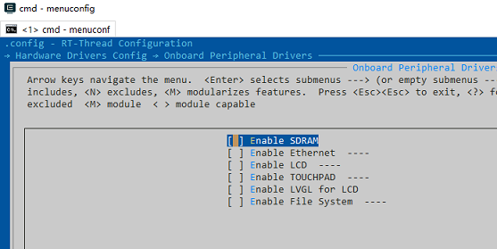
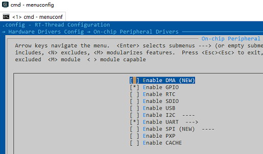
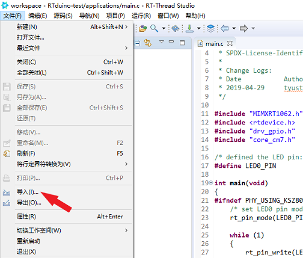
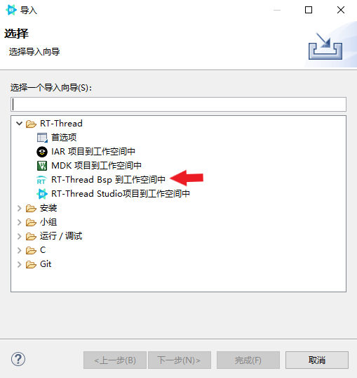
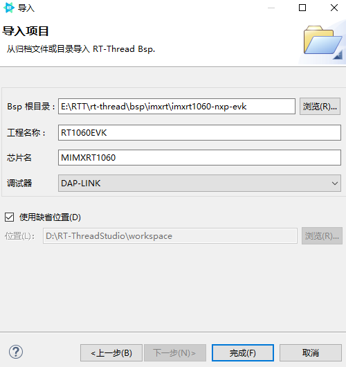
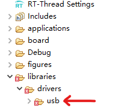
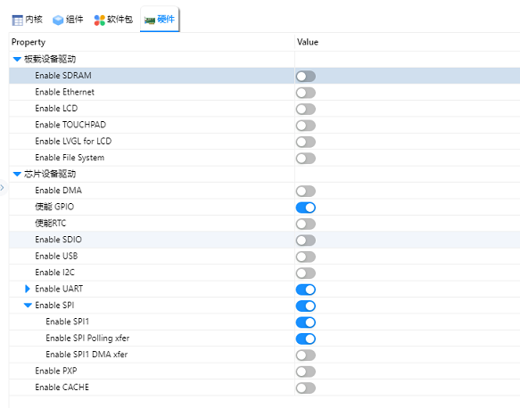
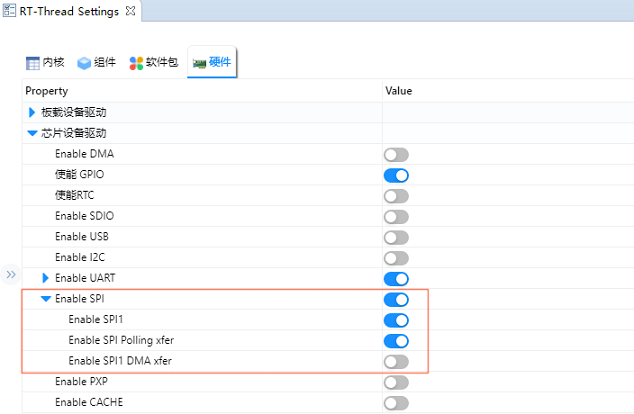
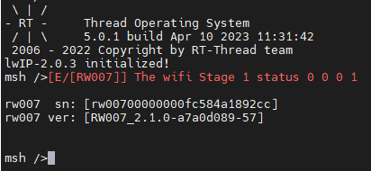
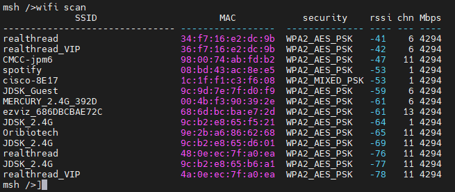

### MIMXRT1060-EVK上手指南

MIMXRT1060-EVK支持RT-Studio工程，本上手指南以RT-Studio环境的开发说明举例。

#### 准备阶段

- 拉取rt-thread的github仓库到本地，[链接地址](https://github.com/RT-Thread/rt-thread)。

- 下载安装RT-Thread Studio,[链接地址](https://www.rt-thread.org/studio.html)。
- 准备RW007模块。

#### BSP上手阶段

- 找到MIMXRT1060-EVK BSP所在目录，使用menuconfig配置工程

  

  取消暂时不需要的配置，具体操作如下：

  - Onboard Peripherial Drivers选项设置

  

  - On-chip Peripherial Drivers选项设置

  

- 点击文件，选择导入选项。



- 选择导入RT-Thread Bsp 到工作空间中

  

  <div STYLE="page-break-after: always;"></div>

- 按照示例填写工程信息



- 移除usb文件夹包含的文件

  

  <div STYLE="page-break-after: always;"></div>

- 编译工程

  

工程编译通过，至此，准备阶段完成。

#### 使用RT-Studio配置BSP驱动

RT-Thread每个BSP已经默认适配了若干片上外设驱动与板载外设驱动，使用RT-Studio将相应的开关直接打开并依据使用环境配置相应参数即可使用。由于各个管脚存在复用功能，所以并不是所有的片上外设驱动与板载外设驱动都可以同时使用，使用时需要结合原理图来合理开启相应的外设驱动。

RT-Thread有许多软件软件包，使用RT-Studio将相应软件包的开关打开便可将软件包添加至工程使用。



#### 联网实操：使用RW007模块联网

RW007 是由上海睿赛德电子科技有限公司开发的高速 WiFi 模块，使用 SPI 与主机通信。[RW007使用指南链接](https://www.rt-thread.org/document/site/#/rt-thread-version/rt-thread-standard/application-note/packages/rw007_module_using/an0034-rw007-module-using)。

MIMXRT1060-EVK板载arduino接口提供的SPI接口与SD卡的SDIO接口使用的管脚存在重复的管脚，所以板载的SPI接口默认未连接，将下方**原理图中标记DNP的地方连接起来(使用SPI接口一定要做这一步！！！)**便可以使用板载arduino接口引出的SPI接口，此时板载的SD卡槽不可使用。


##### MIMXRT1060-EVK使用RW007指南

###### 1.配置板载SPI外设

RW007可采用SPI接口通讯，MIMXRT1060-EVK支持SPI驱动，默认采用轮询的方式与RW007通讯(暂不支持中断与DMA模式与RW007通讯)，使用RT-Studio配置SPI的具体配置如下:



###### 2.使用RT-Studio配置RW007软件包

点击左侧的RT-Thread Settings选项，弹出右侧的配置菜单，在搜索栏中输入RW007,选择`rw007:SPI WIFI rw007 driver `，相应配置参数如下：


###### 3.将RW007模块插入板载的arduino接口


###### 4.修改RW007示例

由于RW007软件包的默认示例是基于STM32的示例，所以在RT1060-EVK上需进行少量的修改，修改RW007软件包中的example文件夹中的rw007_stm32_port.c文件。

修改`int wifi_spi_device_init(void)`函数，使用下述给出的代码替换原有的示例：

```c
int wifi_spi_device_init(void)
{
    char sn_version[32];
    
    rw007_gpio_init();
    rt_hw_spi_device_attach(RW007_SPI_BUS_NAME, "wspi", RW007_CS_PIN);
    rt_hw_wifi_init("wspi");

    rt_wlan_set_mode(RT_WLAN_DEVICE_STA_NAME, RT_WLAN_STATION);
    rt_wlan_set_mode(RT_WLAN_DEVICE_AP_NAME, RT_WLAN_AP);

    rw007_sn_get(sn_version);
    rt_kprintf("\nrw007  sn: [%s]\n", sn_version);
    rw007_version_get(sn_version);
    rt_kprintf("rw007 ver: [%s]\n\n", sn_version);

    return 0;
}
```

###### 5.修改完成后，编译工程，烧录固件。



`rw007 sn`与`rw007 ver`可以正常输出无乱码时，RW007驱动成功！！！

###### 6. wifi联网测试

在shell中输入`wifi scan`命令搜索WIFI。



输入`wifi`,按`tab`键列出wifi相关命令：


连接目标wifi测试，使用ping命令测试是否连接成功：


至此MIMXRT1060-EVK的基础环境便搭建测试完毕！！！。