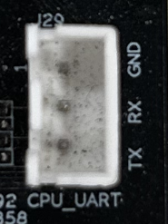
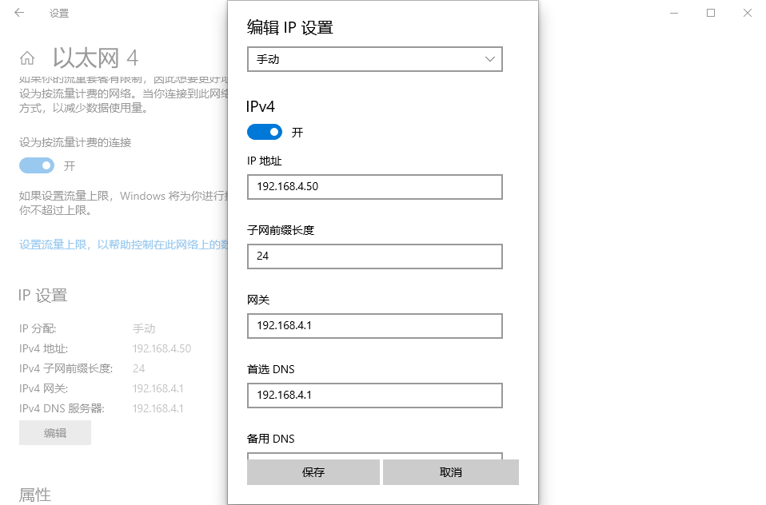
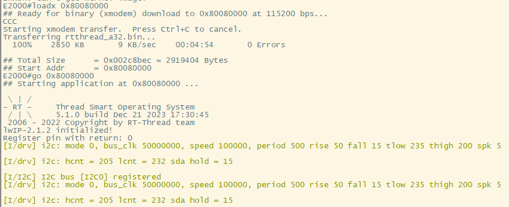

# 如何启动镜像程序

- 当完成项目的配置和编译后，请参考以下两种方法，在开发板上启动镜像程序。需要提前下载串口工具，以SecureCRT为例

- 需要按照以下方式将开发板的串口与TTL接口相连，并与上位机相连

1. E2000D_DEMO开发板，E2000Q_DEMO开发板，使用CPU_UART



2. Phytium PI开发板，使用J2组引脚


## 使用tftp服务，通过网口上传镜像(推荐)

- 通过tftp服务，使用网口将 .bin/.elf 文件上传到开发板


### Ubuntu 环境下配置tftp服务

- 在开发环境`host`侧安装`tftp`服务
```
sudo apt-get install tftp-hpa tftpd-hpa
sudo apt-get install xinetd
```

- 新建`tftpboot`目录, 以`/mnt/d/tftpboot`为例，并确保 `tftpboot` 目录有执行权限`chmod 777 /**/tftpboot`
- 配置主机 tftpboot 服务, 新建并配置文件`/etc/xinetd.d/tftp`

```
# /etc/xinetd.d/tftp

server tftp
{
  socket_type = dgram
  protocol = udp
  wait = yes
  user = root
  server =  /usr/sbin/in.tftpd
  server_args = -s /mnt/d/tftpboot
  disable = no
  per_source = 11
  cps = 100 2
  flags = IPv4
}
```

- 启动主机`tftp`服务，生成默认配置
```
$ sudo service tftpd-hpa start
```

- 修改主机`tftp`配置，指向`tftpboot`目录
  修改/etc/default/tftpd-hpa
```
$ sudo nano /etc/default/tftpd-hpa
# /etc/default/tftpd-hpa

TFTP_USERNAME="tftp"
TFTP_DIRECTORY="/mnt/d/tftpboot"
TFTP_ADDRESS=":69"
TFTP_OPTIONS="-l -c -s"
```

- 重启主机`tftp`服务

```
$ sudo service tftpd-hpa restart
```

- 测试主机`tftp`服务的可用性
  > 登录`tftp`服务，获取`tftpboot`目录下的一个文件

```
$ tftp 192.168.4.50
tftp> get test1234
tftp> q
```

### Windows 环境下配置tftp服务

- 下载 Tftpd64 工具，并安装


- 之后每次使用前，进入Windows服务，手动将服务打开


### 使用uboot上的tftp服务加载镜像
- `host`侧，网络配置如下



- 进入`uboot`界面，输入如下指令，配置开发板ip，`host`侧ip和网关地址
```
setenv ipaddr 192.168.4.20  
setenv serverip 192.168.4.50 
setenv gatewayip 192.168.4.1 
```
- 将编译好的elf 或者bin 文件拷贝至Tftpd64所设置文件夹下
- 随后烧录的文件到开发板
- aarch64 输入以下指令
```
tftpboot 0x80080000 rtthread_a64.bin
dcache flush
go 0x80080000
```

- aarch32 输入以下指令
```
tftpboot 0x80100000 rtthread_a64.bin
dcache flush
go 0x80100000
```


## 使用串口工具

- 可以用串口通过XMODEM协议将`.bin`文件上传到开发板

1. 启动开发板，进入uboot界面，输入以下指令
- aarch64输入以下指令
```
loadx 0x80080000
```
- 发送`.bin`文件


- 完成跳转
```
go 0x80080000
```
- aarch32输入以下指令
```
loadx 0x80100000
```
- 发送`.bin`文件


- 完成跳转
```
go 0x80100000
```



