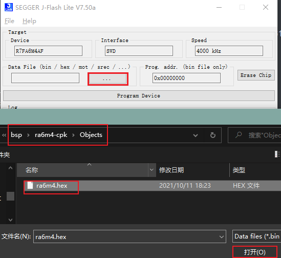
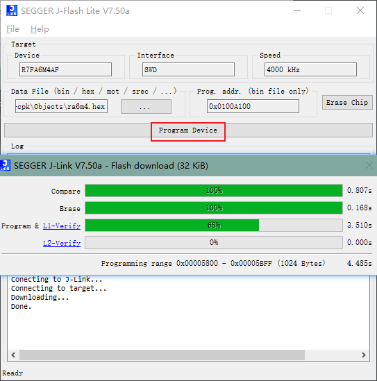

# 瑞萨 CPK-RA6M4 开发板 BSP 说明

## 简介

本文档为瑞萨 CPK-RA6M4 开发板提供的 BSP (板级支持包) 说明。通过阅读快速上手章节开发者可以快速地上手该 BSP，将 RT-Thread 运行在开发板上。

主要内容如下：

- 开发板介绍
- BSP 快速上手指南

## 开发板介绍

基于瑞萨 RA6M4 MCU 开发的 CPK-RA6M4 MCU 评估板，通过灵活配置软件包和 IDE，可帮助用户对 RA6M4 MCU 群组的特性轻松进行评估，并对嵌入系统应用程序进行开发。

开发板正面外观如下图：


该开发板常用 **板载资源** 如下：

- MCU：R7FA6M4AF3CFB，200MHz，Arm Cortex®-M33 内核，1MB 代码闪存, 256kB SRAM
- 调试接口：板载 J-Link 接口
- 扩展接口：两个 PMOD 连接器

**更多详细资料及工具**


## 外设支持

本 BSP 目前对外设的支持情况如下：

| **片上外设** | **支持情况** | **备注**                  |
| :----------- | :---------- | :------------------------ |
| UART         |     支持     | UART7               |
| GPIO | 支持 |          |
| IIC | 支持 | 软件 |
| WDT | 支持 | |
| RTC | 支持 | |
| 持续更新中... | | |


## 使用说明

使用说明分为如下两个章节：

- 快速上手

    本章节是为刚接触 RT-Thread 的新手准备的使用说明，遵循简单的步骤即可将 RT-Thread 操作系统运行在该开发板上，看到实验效果 。

- 进阶使用

    本章节是为需要在 RT-Thread 操作系统上使用更多开发板资源的开发者准备的。通过使用 ENV 工具对 BSP 进行配置，可以开启更多板载资源，实现更多高级功能。


### 快速上手

本 BSP 为目前仅为开发者提供 MDK5 工程。下面以 MDK5 开发环境为例，介绍如何将系统运行起来。

**硬件连接**

使用 USB 数据线连接开发板到 PC。使用 USB 转串口工具连接 P613(TXD)、P614(RXD)。

**编译下载**

- 编译：双击 project.uvprojx 文件，打开 MDK5 工程，编译程序。

> 注意：此工程需要使用 J-Flash Lite 工具烧录程序。建议使用 V7.50 及以上版本烧录工程。[J-Link 下载链接](https://www.segger.com/downloads/jlink/)

- 下载：打开 J-Flash lite 工具，选择芯片型号 R7FA6M4AF，点击 OK 进入工具。选择 BSP 目录下 MDK 编译出的 /object/ra6m4.hex 文件，点击 Program Device 按钮开始烧录。具体操作过程可参考下图步骤：






**查看运行结果**

下载程序成功之后，系统会自动运行并打印系统信息。

连接开发板对应串口到 PC , 在终端工具里打开相应的串口（115200-8-1-N），复位设备后，可以看到 RT-Thread 的输出信息。输入 help 命令可查看系统中支持的命令。

```bash
 \ | /
- RT -     Thread Operating System
 / | \     4.0.4 build Oct 11 2021
 2006 - 2021 Copyright by rt-thread team

Hello RT-Thread!
msh >
msh >help
RT-Thread shell commands:
reboot           - Reboot System
help             - RT - Thread shell help.
ps               - List threads in the system.
free             - Show the memory usage in the system.
hello            - say hello world
clear            - clear the terminal screen
version          - show RT - Thread version information
list_thread      - list thread
list_sem         - list semaphore in system
list_event       - list event in system
list_mutex       - list mutex in system
list_mailbox     - list mail box in system
list_msgqueue    - list message queue in system
list_timer       - list timer in system
list_device      - list device in system
list             - list all commands in system

msh > 
```

**应用入口函数**

应用层的入口函数在 **bsp\ra6m4-cpk\src\hal_emtry.c** 中 的 `void hal_entry(void)` 。用户编写的源文件可直接放在 src 目录下。

```c
void hal_entry(void)
{
    rt_kprintf("\nHello RT-Thread!\n");

    while (1)
    {
        rt_pin_write(LED3_PIN, PIN_HIGH);
        rt_thread_mdelay(500);
        rt_pin_write(LED3_PIN, PIN_LOW);
        rt_thread_mdelay(500);
    }
}
```

### 进阶使用

**ENV 配置**

- 如何使用 ENV 工具：[RT-Thread env 工具用户手册](https://www.rt-thread.org/document/site/#/development-tools/env/env)

此 BSP 默认只开启了 串口7 的功能，如果需使用更多高级功能例如组件、软件包等，需要利用 ENV 工具进行配置。步骤如下：

1. 在 bsp 下打开 env 工具。

2. 输入`menuconfig`命令配置工程，配置好之后保存退出。

3. 输入`pkgs --update`命令更新软件包。

4. 输入`scons --target=mdk5` 命令重新生成工程。

**FSP 配置**

如果需要修改瑞萨的 BSP 外设配置或者需要添加新的外设端口，需要用到瑞萨的 FSP 配置工具。

1. [下载灵活配置软件包 (FSP) | Renesas](https://www.renesas.com/cn/zh/software-tool/flexible-software-package-fsp)
2. 下载安装完成后，需要添加这款开发板的官方[CPK-RA6M4板级支持包](https://www2.renesas.cn/document/sws/1527176?language=zh&r=1527191)
3. 如何将BSP配置包添加到 FSP 中，请参考文档[如何导入板级支持包](https://www2.renesas.cn/document/ppt/1527171?language=zh&r=1527191)
4. 在 MDK 中添加自定义命名来打开当前工程的配置详细步骤，请查看文档： [使用瑞萨 FSP 配置工具](./docs/使用瑞萨FSP配置工具.md)

## 更多资料及文档

- [开发板官网主页](https://www2.renesas.cn/cn/zh/products/microcontrollers-microprocessors/ra-cortex-m-mcus/cpk-ra6m4-evaluation-board)

- [开发板用户手册](https://www2.renesas.cn/cn/zh/document/mah/1527156?language=zh&r=1527191)

- [瑞萨RA MCU 基础知识](https://www2.renesas.cn/cn/zh/document/gde/1520091) 

- [RA6 MCU 快速设计指南](https://www2.renesas.cn/cn/zh/document/apn/ra6-quick-design-guide) 

- [RA6M4_datasheet](https://www2.renesas.cn/cn/zh/document/dst/ra6m4-group-datasheet) 

- [RA6M4 Group User’s Manual: Hardware](https://www2.renesas.cn/cn/zh/document/man/ra6m4-group-user-s-manual-hardware) 

## 联系人信息

在使用过程中若您有任何的想法和建议，建议您通过以下方式来联系到我们  [RT-Thread 社区论坛](https://club.rt-thread.org/)

## 贡献代码

如果您对 CPK-RA6M4 感兴趣，并且有一些好玩的项目愿意与大家分享的话欢迎给我们贡献代码，您可以参考 [向 RT-Thread 代码贡献](https://www.rt-thread.org/document/site/#/rt-thread-version/rt-thread-standard/development-guide/github/github) 。