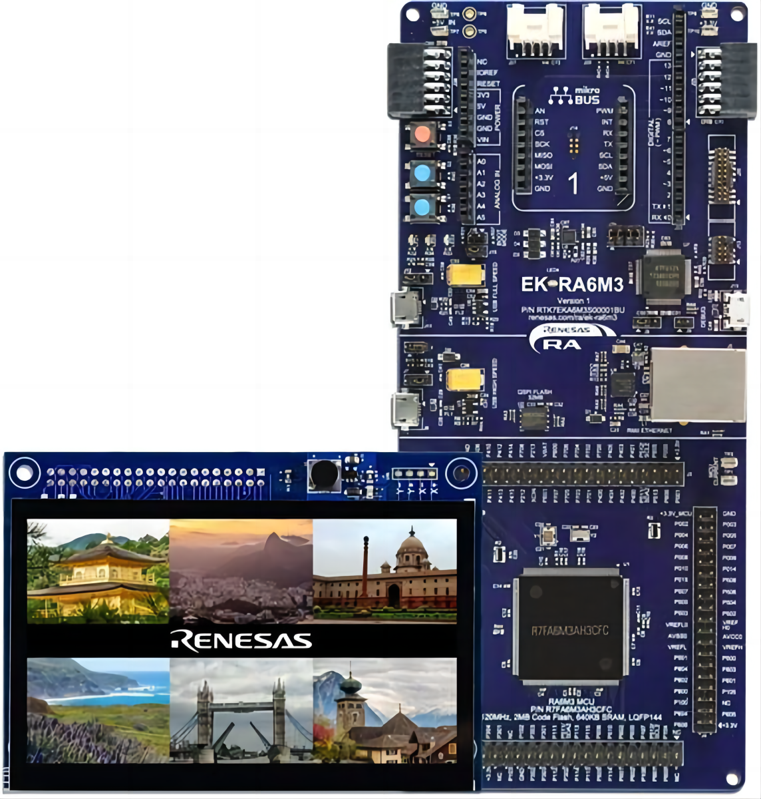

# 瑞萨 CPK-RA6M3 开发板 BSP 说明

## 简介

本文档为瑞萨 CPK-RA6M3 开发板提供的 BSP (板级支持包) 说明。通过阅读快速上手章节开发者可以快速地上手该 BSP，将 RT-Thread 运行在开发板上。

主要内容如下：

- 开发板介绍
- BSP 快速上手指南

## 开发板介绍

基于瑞萨 RA6M3 MCU 开发的 EK-RA6M3 MCU 评估板，通过灵活配置软件包和 IDE，可帮助用户对 RA6M3 MCU 群组的特性轻松进行评估，并对嵌入系统应用程序进行开发。

开发板正面外观如下图：

 


该开发板常用 **板载资源** 如下：

- MCU：R7FA6M3AH，120MHz，Arm Cortex®-M4 内核，2MB 代码闪存, 640KB SRAM
- 调试接口：板载 J-Link 接口
- 扩展接口：两个 PMOD 连接器

**更多详细资料及工具**

## 外设支持

本 BSP 目前对外设的支持情况如下：

| **片上外设** | **支持情况** | **备注** |
| :----------------- | :----------------- | :------------- |
| UART               | 支持               | UART7 为默认日志输出端口 |
| GPIO               | 支持               |                |
| GPIO         | 支持         |                          |
| IIC          | 支持         | 软件                     |
| WDT          | 支持         |                          |
| RTC          | 支持         |                          |
| ADC          | 支持         |                          |
| DAC          | 支持         |                          |
| SPI          | 支持         |                          |
| FLASH        | 支持         |                |
| PWM          | 支持         |                |
| LCD          | 支持         |                          |
| G2D  | 支持 |                |
| JPEG         | 支持         |                          |


## 使用说明

使用说明分为如下两个章节：

- 快速上手

  本章节是为刚接触 RT-Thread 的新手准备的使用说明，遵循简单的步骤即可将 RT-Thread 操作系统运行在该开发板上，看到实验效果 。
- 进阶使用

  本章节是为需要在 RT-Thread 操作系统上使用更多开发板资源的开发者准备的。通过使用 ENV 工具对 BSP 进行配置，可以开启更多板载资源，实现更多高级功能。

### 快速上手

本 BSP 目前仅提供 MDK5 工程。下面以 MDK5 开发环境为例，介绍如何将系统运行起来。

**硬件连接**

使用 USB 数据线连接开发板到 PC，使用 J-link 接口下载和 DEBUG 程序。使用 USB 转串口工具连接 UART7：P401(TXD)、P402(RXD)。

**编译下载**

- 编译：双击 project.uvprojx 文件，打开 MDK5 工程，编译程序。

- 下载：点击 MDK 的 Debug 按钮进行下载调试

**查看运行结果**

下载程序成功之后，系统会自动运行并打印系统信息。

连接开发板对应串口到 PC , 在终端工具里打开相应的串口（115200-8-1-N），复位设备后，可以看到 RT-Thread 的输出信息。输入 help 命令可查看系统中支持的命令。

```bash
 \ | /
- RT -     Thread Operating System
 / | \     5.0.0 build Jan  4 2023 10:14:56
 2006 - 2022 Copyright by RT-Thread team
Hello RT-Thread!
msh >
msh >help
help             - RT-Thread shell help.
ps               - List threads in the system.
free             - Show the memory usage in the system.
clear            - clear the terminal screen
version          - show RT-Thread version information
list             - list objects

msh > 
```

**应用入口函数**

应用层的入口函数在 **bsp\ra6m3-ek\src\hal_emtry.c** 中 的 `void hal_entry(void)` 。用户编写的源文件可直接放在 src 目录下。

```c
void hal_entry(void)
{
    rt_kprintf("\nHello RT-Thread!\n");

    while (1)
    {
        rt_pin_write(LED3_PIN, PIN_HIGH);
        rt_thread_mdelay(500);
        rt_pin_write(LED3_PIN, PIN_LOW);
        rt_thread_mdelay(500);
    }
}
```

### 进阶使用

**资料及文档**

- [开发板官网主页](https://www2.renesas.cn/cn/zh/products/microcontrollers-microprocessors/ra-cortex-m-mcus/cpk-ra6m4-evaluation-board)
- [开发板用户手册](https://www2.renesas.cn/cn/zh/document/mah/1527156?language=zh&r=1527191)
- [瑞萨RA MCU 基础知识](https://www2.renesas.cn/cn/zh/document/gde/1520091)
- [RA6 MCU 快速设计指南](https://www2.renesas.cn/cn/zh/document/apn/ra6-quick-design-guide)
- [RA6M4_datasheet](https://www2.renesas.cn/cn/zh/document/dst/ra6m4-group-datasheet)
- [RA6M4 Group User’s Manual: Hardware](https://www2.renesas.cn/cn/zh/document/man/ra6m4-group-user-s-manual-hardware)

**FSP 配置**

需要修改瑞萨的 BSP 外设配置或添加新的外设端口，需要用到瑞萨的 [FSP](https://www2.renesas.cn/jp/zh/software-tool/flexible-software-package-fsp#document) 配置工具。请务必按照如下步骤完成配置。配置中有任何问题可到[RT-Thread 社区论坛](https://club.rt-thread.org/)中提问。

1. [下载灵活配置软件包 (FSP) | Renesas](https://www.renesas.com/cn/zh/software-tool/flexible-software-package-fsp)，请使用 FSP 3.5.0 版本
2. 下载安装完成后，需要添加 CPK-RA6M3 开发板的官方板级支持包
> 打开[ CPK-RA6M3 开发板详情页](https://www.renesas.cn/cn/zh/products/microcontrollers-microprocessors/ra-cortex-m-mcus/ek-ra6m3-evaluation-kit-ra6m3-mcu-group#document)，在**“下载”**列表中找到 **”CPK-RA6M3板级支持包“**，点击链接即可下载
3. 如何将 **”CPK-RA6M3板级支持包“**添加到 FSP 中，请参考文档[如何导入板级支持包](https://www2.renesas.cn/document/ppt/1527171?language=zh&r=1527191)
4. 请查看文档：[使用 FSP 配置外设驱动](../docs/RA系列使用FSP配置外设驱动.md)，在 MDK 中通过添加自定义命名来打开当前工程的 FSP 配置。

**ENV 配置**

- 如何使用 ENV 工具：[RT-Thread env 工具用户手册](https://www.rt-thread.org/document/site/#/development-tools/env/env)

此 BSP 默认只开启了 UART7 的功能，如果需使用更多高级功能例如组件、软件包等，需要利用 ENV 工具进行配置。

步骤如下：
1. 在 bsp 下打开 env 工具。
2. 输入`menuconfig`命令配置工程，配置好之后保存退出。
3. 输入`pkgs --update`命令更新软件包。
4. 输入`scons --target=mdk5` 命令重新生成工程。 

## 联系人信息

在使用过程中若您有任何的想法和建议，建议您通过以下方式来联系到我们  [RT-Thread 社区论坛](https://club.rt-thread.org/)

## 贡献代码

如果您对 CPK-RA6M3 感兴趣，并且有一些好玩的项目愿意与大家分享的话欢迎给我们贡献代码，您可以参考 [如何向 RT-Thread 代码贡献](https://www.rt-thread.org/document/site/#/rt-thread-version/rt-thread-standard/development-guide/github/github)。
