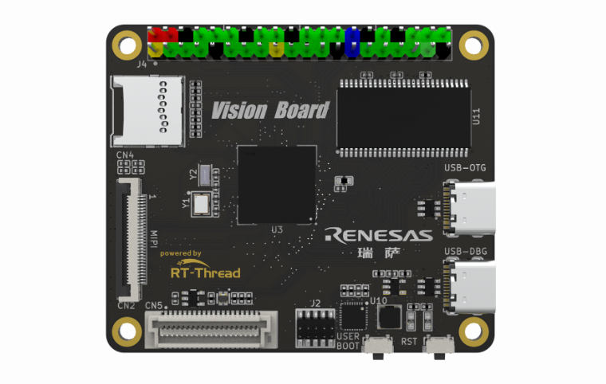
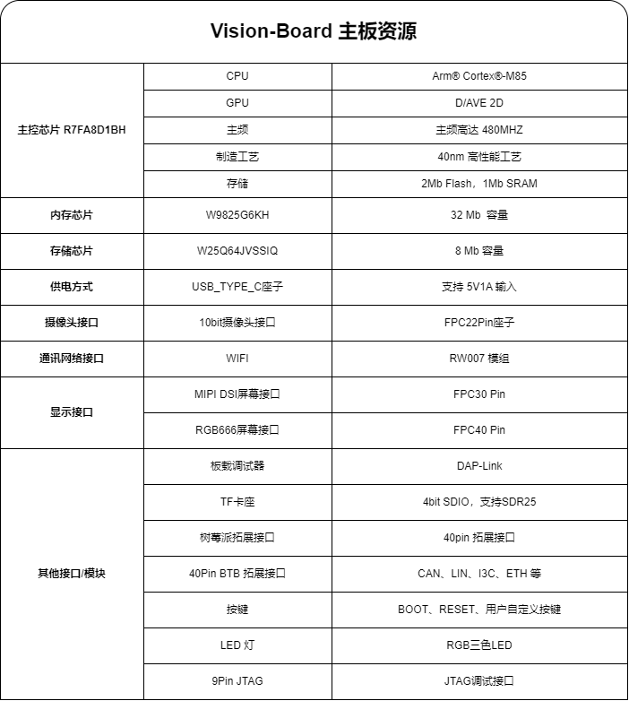

# Vision Board 开发板 BSP 说明

## 简介

Vision-Board 开发板是 RT-Thread 推出基于瑞萨 Cortex-M85 架构 RA8D1 芯片，为工程师们提供了一个灵活、全面的开发平台，助力开发者在机器视觉领域获得更深层次的体验。



## 开发板介绍

该开发板常用 **板载资源** 如下：



## 外设支持

本 BSP 目前对外设的支持情况如下：

| **片上外设** | **支持情况** |         **备注**          |
| :----------: | :----------: | :-----------------------: |
|     UART     |     支持     | UART9 为默认日志输出端口  |
|     GPIO     |     支持     |                           |
|     USB      |     支持     |          TinyUSB          |
|    Camera    |     支持     | ov2640、ov7725、ov7670... |
|     SDHC     |     支持     |        1bit、4bit         |
|     ADC      |     支持     |                           |
|     DAC      |     支持     |                           |
|     SPI      |     支持     |                           |
|     PWM      |     支持     |                           |
|     RTC      |     支持     |                           |
|    FLASH     |     支持     |                           |
|     WDT      |     支持     |                           |
|     IIC      |     支持     |                           |
|    Wi-Fi     |     支持     |           RW007           |

* 注意：仓库刚拉下来是最小系统，若需添加/使能其他外设需参考：[外设驱动使用教程 (rt-thread.org)](https://www.rt-thread.org/document/site/#/rt-thread-version/rt-thread-standard/tutorial/make-bsp/renesas-ra/RA系列BSP外设驱动使用教程)

## 模板工程说明


如上图所示，RGB-LED 属于共阳 LED， **阴极** 分别与单片机的引脚相连，其中蓝色 LED 对应 P102 引脚。单片机引脚输出低电平即可点亮 LED，输出高电平则会熄灭 LED。

## 软件说明

闪灯的源代码位于 `ra8d1-vision-board/src/hal_entry.c` 中。首先定义了一个宏 `LED_PIN` ，代表闪灯的 LED 引脚编号，然后与 `BSP_IO_PORT_01_PIN_02`（**P102 **）对应：

```
#define LED_PIN    BSP_IO_PORT_01_PIN_02 /* Onboard LED pins */
```

在 main 函数中，将该引脚配置为输出模式，并在下面的 while 循环中，周期性（500毫秒）开关 LED。

```
void hal_entry(void)
{
    rt_kprintf("\nHello RT-Thread!\n");

    while (1)
    {
        rt_pin_write(LED_PIN, PIN_HIGH);
        rt_thread_mdelay(500);
        rt_pin_write(LED_PIN, PIN_LOW);
        rt_thread_mdelay(500);
    }
}
```

## 使用说明

使用说明分为如下两个章节：

- 快速上手

  本章节是为刚接触 RT-Thread 的新手准备的使用说明，遵循简单的步骤即可将 RT-Thread 操作系统运行在该开发板上，看到实验效果 。

- 进阶使用

  本章节是为需要在 RT-Thread 操作系统上使用更多开发板资源的开发者准备的。通过使用 ENV 工具对 BSP 进行配置，可以开启更多板载资源，实现更多高级功能。

### 支持的编译平台

* armclang（AC6 V6.19）
* LLVM（V16/17）[ARM-software/LLVM-embedded-toolchain-for-Arm (github.com)](https://github.com/ARM-software/LLVM-embedded-toolchain-for-Arm/releases/tag/release-17.0.1)

## FSP版本说明

本BSP使用的是FSP5.1.0版本，进行外设相关开发需要下载并安装。

* 下载链接：[rasc-5.1.0](https://github.com/renesas/fsp/releases/download/v5.1.0/setup_fsp_v5_1_0_rasc_v2023-10.exe)

* 注意：BSP默认是最小系统，若需添加/使能其他外设需参考：[外设驱动使用教程 (rt-thread.org)](https://www.rt-thread.org/document/site/#/rt-thread-version/rt-thread-standard/tutorial/make-bsp/renesas-ra/RA系列BSP外设驱动使用教程)

### 快速上手

#### 1、使用 MDK 编译：

本 BSP 目前提供 MDK5 工程。下面以 MDK5 开发环境为例，介绍如何将系统运行起来。

**编译下载**

- 编译：双击 project.uvprojx 文件，打开 MDK5 工程，编译程序。
- 下载：点击 MDK 的 Debug 按钮进行下载调试

#### 2、使用 LLVM 编译

使用 env 工具打开当前 bsp，设定要使用的工具链和对应的路径。

```shell
set RTT_CC=llvm-arm
set RTT_EXEC_PATH=D:\Progrem\LLVMEmbeddedToolchainForArm-17.0.1-Windows-x86_64\bin
```

然后运行 scons 命令，执行编译

```shell
scons
```

**查看运行结果**

下载程序成功之后，系统会自动运行并打印系统信息。

连接开发板对应串口到 PC , 在终端工具里打开相应的串口（115200-8-1-N），复位设备后，可以看到 RT-Thread 的输出信息。输入 help 命令可查看系统中支持的命令。

```bash
[D/main] sdram init success, mapped at 0x68000000, size is 33554432 bytes, data width is 16

 \ | /
- RT -     Thread Operating System
 / | \     5.1.0 build Mar  5 2024 13:57:23
 2006 - 2024 Copyright by RT-Thread team

Hello RT-Thread!
msh >
msh >
```

### 进阶使用

**资料及文档**

- [开发板官网主页](https://www.renesas.cn/cn/zh/products/microcontrollers-microprocessors/ra-cortex-m-mcus/ek-ra8d1-evaluation-kit-ra8d1-mcu-group#overview)
- [开发板用户手册](https://www.renesas.cn/cn/zh/document/mat/ek-ra8d1-v1-users-manual?r=25452351)
- [瑞萨RA MCU 基础知识](https://www2.renesas.cn/cn/zh/document/gde/1520091)

**ENV 配置**

- 如何使用 ENV 工具：[RT-Thread env 工具用户手册](https://www.rt-thread.org/document/site/#/development-tools/env/env)

此 BSP 默认只开启了 UART9 的功能，如果需使用更多高级功能例如组件、软件包等，需要利用 ENV 工具进行配置。

步骤如下：

1. 在 bsp 下打开 env 工具。
2. 输入`menuconfig`命令配置工程，配置好之后保存退出。
3. 输入`pkgs --update`命令更新软件包。
4. 输入`scons --target=mdk5` 命令重新生成工程。 

**FSP配置**

*   如何使用 FSP：[RA系列使用 FSP 配置外设驱动](https://www.rt-thread.org/document/site/#/rt-thread-version/rt-thread-standard/tutorial/make-bsp/renesas-ra/RA系列使用FSP配置外设驱动?id=ra系列使用-fsp-配置外设驱动)

目前仓库 bsp 默认使能最小体量配置，用户可通过如下步骤使能 env 外设配置：

1. 在 bsp 目录下打开 env 工具，使用 `scons --target=mdk5`命令生成 MDK 工程。
2. 打开 bsp 目录下的`project.uvprojx`文件，选择上方导航栏的 `Software Components`配置，打开后找到`Flex Software`下的`RA Configuration`旁的配置按钮，该操作会自动查找当前电脑环境下安装的 fsp 版本，选择指定版本后进入 fsp。 
   
3. 在进入 fsp 后我们可以发现，已经存在了一些已经配置完成的外设，此时我们点击`Generate Project Content`按钮即可生成所需驱动文件。
   
4. 接下来回到 env，使能所需的外设配置后保存退出即可。

## 联系人信息

在使用过程中若您有任何的想法和建议，建议您通过以下方式来联系到我们  [RT-Thread 社区论坛](https://club.rt-thread.org/)

## SDK 仓库

这是 Vision Board 的 SDK 仓库地址：[sdk-bsp-ra8d1-vision-board](https://github.com/RT-Thread-Studio/sdk-bsp-ra8d1-vision-board)，该仓库包括了外设驱动以及丰富的示例工程，如果像体验官网/社区提供的开源示例请转移到该仓库进行开发。RT-Thread 主仓库只维护最新的驱动相关代码。

## 贡献代码

如果您对  Vision Board 感兴趣，并且有一些好玩的项目愿意与大家分享的话欢迎给我们贡献代码，您可以参考 [如何向 RT-Thread 代码贡献](https://www.rt-thread.org/document/site/#/rt-thread-version/rt-thread-standard/development-guide/github/github)。
