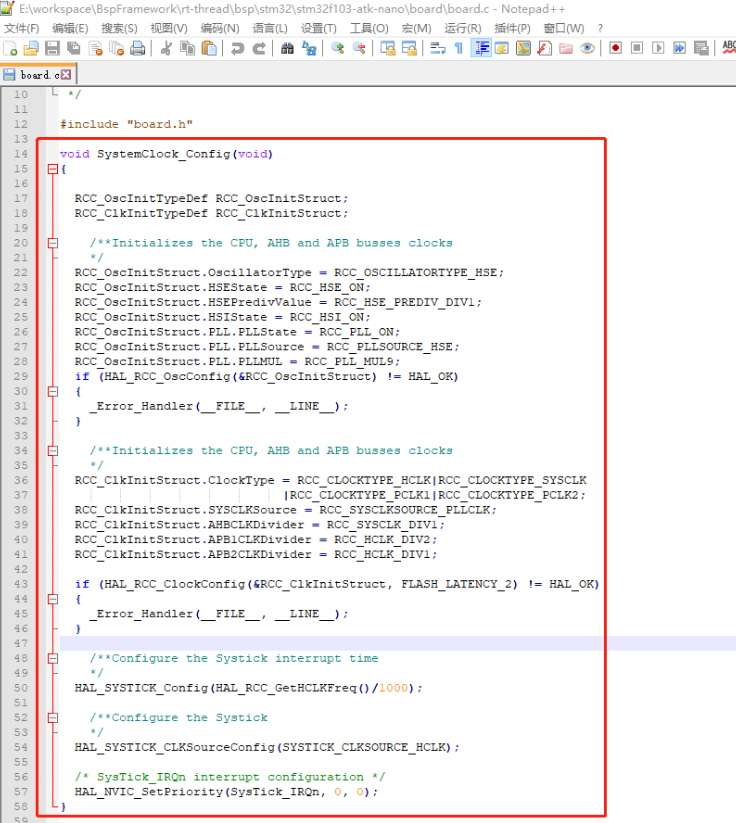
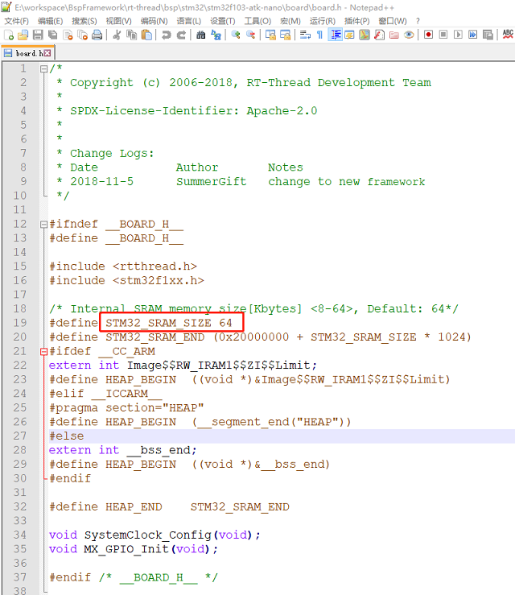
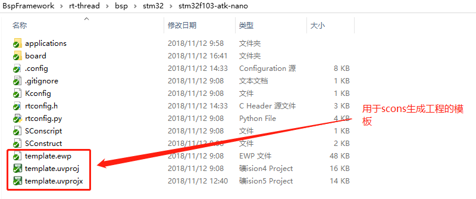
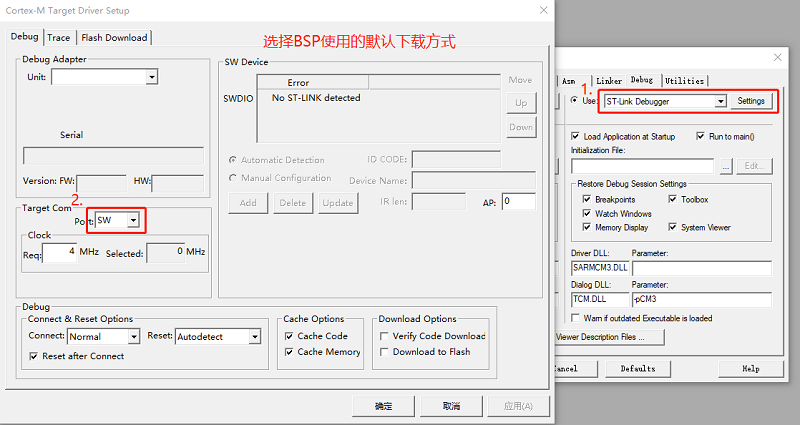
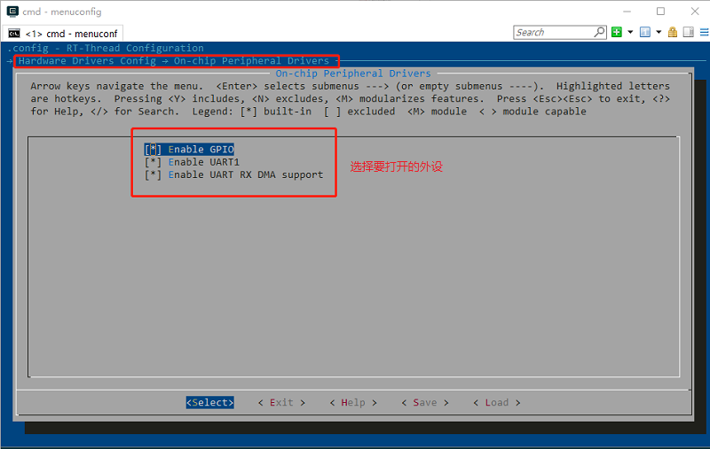

# STM32 系列 BSP 添加教程

为了让广大开发者更好、更方便地使用 BSP 进行开发，RT-Thread 开发团队重新整理了现有的 STM32 系列的 BSP，推出了新的 BSP 框架。新的 BSP 框架在易用性、移植便利性、驱动完整性、代码规范性等方面都有较大提升，在新的 BSP 框架下进行开发，可以大大提高应用的开发效率。

和 RT-Thread 以往提供的 BSP 不同，在新的 BSP 文件夹中将不会包含固件库、外设驱动等可以被多个 BSP 引用的代码文件。而是将这些通用的文件统一存放在 Library 文件夹中，通过在特定 BSP 中引用这些文件的方式，来包含 BSP 中所需的库文件或者驱动文件。这种方式不仅大大提高了代码复用率，降低了 BSP 的维护成本，而且可以更方便地给开发者提供更丰富的驱动文件，让开发者可以更容易地找到自己需要的资源。

新的 BSP 框架还引入了 CubeMX 工具，使用该工具来对 BSP 中使用的外设引脚进行配置。CubeMX 工具 提供了图形化的配置界面，这种图形化的配置方式对开发者来说更加直观，不仅可以让开发者灵活地配置 BSP 中使用的资源，并且可以让开发者对资源的使用情况一目了然。

新 BSP 框架的主要特性如下：

- 提供多系列 BSP 模板，大大降低新 BSP 的添加难度；
- 每个 BSP 都配有齐全的驱动文件，开发者可以方便地使用所有驱动；
- 开发者可以使用 CubeMX 工具对 BSP 进行图形化配置；

## BSP 框架介绍 

BSP 框架结构如下图所示：

STM32 BSP 由三部分组成，分别是 (1) 通用库、(2) BSP 模板和 (3) 特定芯片 BSP，下面的表格以 F1 系列 BSP 为例介绍这三个部分：

|项目|文件夹|说明|
| - | - | :-- |
| 通用库 | stm32/libraries | 用于存放 HAL 库以及基于 HAL 库的通用驱动文件 |
| F1 系列 BSP 工程模板 | stm32/libraries/templates/stm32f10x | F1系列 BSP 模板，通过修改该模板制作更多 F1系列 BSP |
| 特定开发板 BSP | stm32/stm32f103-atk-nano | 在 BSP 模板的基础上修改而成 |

## 新 BSP 添加方法

本节以添加一个新的名为 `stm32f103-atk-nano` 的 BSP 为例，讲解如何添加一个新的 STM32 系列 BSP。

新的 BSP 可以通过修改相应系列的 BSP 模板而快速得到，开发者需要修改的文件主要是在 board 文件夹下，下表总结了需要修改的文件内容：

| 项目 | 需要修改的内容说明 |
|-------------|-------------------------------------------------------|
| CubeMX_Config （文件夹）| CubeMX 工程 |
|board.c/h | 系统时钟、GPIO 初始化函数、芯片 SRAM 大小 |
| Kconfig | 芯片型号、系列、外设资源 |
| SConscript | 芯片启动文件、目标芯片型号 |
| linker_scripts （文件夹）| BSP 特定的链接脚本 |
| template.uvprojx ; template.uvproj ; template.ewp | MDK/IAR 工程模板：修改芯片型号、仿真器选项 |

添加新 BSP 的过程分为如下五个步骤：

1. 复制通用模板
2. 使用 CubeMX 配置工程
3. 修改 Kconfig 文件中 BSP 的特定选项
4. 修改构建工程相关文件
5. 重新生成工程

在接下来的章节中将会详细介绍这五个步骤，帮助开发者快速创建所需要的 BSP。

### 复制通用模板

制作新 BSP 的第一步是复制一份同系列的 BSP 模板作为新 BSP 的基础，目前提供的通用 BSP 模板如下：

| 工程模板 | 说明 |
| ------- | ---- |
| libraries/templates/stm32f10x | F1系列芯片模板 |
| libraries/templates/stm32f4xx | F4系列芯片模板 |
| libraries/templates/stm32l4xx | L4系列芯片模板 |

拷贝 `stm32/libraries/templates/stm32f10x` 文件夹并改名为 `stm32/stm32f103-atk-nano` 。如下图所示：

### 使用 CubeMX 配置工程

这一步中需要在 **CubeMX_Config** 文件夹下创建一个基于目标芯片的 CubeMX 工程，本次创建示例 BSP 选择的芯片型号为 STM32F103RBTx 。

#### 重新生成 CubeMX 工程

配置系统时钟、外设引脚等，步骤如下图所示：

1. 打开外部时钟、设置下载方式、打开串口外设：

2. 配置系统时钟：

3. 设置项目名称，并在指定地址重新生成 CubeMX 工程：

最终 CubeMX 生成的工程目录结构如下图所示：

#### 拷贝初始化函数

**board.c** 文件中只包含 SystemClock_Config() 和 MX_GPIO_Init() 这两个函数。这两个函数由 CubeMX 工具生成，需要从目录 `board/CubeMX_Config/Src/main.c` 文件中拷贝到 board.c 文件中，如下图所示：

 **board.h** 文件内 STM32_SRAM_SIZE 大小修改如下图所示：

### 修改 Kconfig 选项

修改 `board/Kconfig` 文件内容，如下图所示：

上图中使用的宏定义说明如下所示：

| 宏定义 | 意义 | 格式 |
|-|-|-|
| SOC_STM32F103RB | 芯片型号 | SOC_STM32xxx |
| SOC_SERIES_STM32F1 | 芯片系列| SOC_SERIES_STM32xx |

用户可参考这个链接学习 Kconfig语法：(https://blog.csdn.net/jianwen_hi/article/details/53398141)

### 修改工程构建相关文件
接下来需要修改用于构建工程相关的文件。

#### 修改链接脚本
**linker_scripts** 链接文件如下图所示：

修改这些文件需要用户掌握链接脚本语法，根据相应的芯片进行修改。

####  修改 SConscript 构建脚本
**SConscript** 脚本决定 MDK/IAR 工程的生成过程中要添加那些文件。在这一步中需要修改芯片型号以及芯片启动文件的地址，修改内容如下图所示：

注意：如果在文件夹中找不到相应系列的 .s 文件，可能是多个系列的芯片重用了相同的启动文件，此时可以在 CubeMX 中生成目标芯片的工程，查看使用了哪个启动文件，然后再修改启动文件名。

#### 修改工程模板

**template** 文件是生成 MDK/IAR 工程的模板文件，通过修改该文件可以设置工程中使用的芯片型号以及下载方式。MDK4/MDK5/IAR 的工程模板文件，如下图所示：

下面以 MDK5 模板的修改为例，介绍如何修改模板配置：

修改程序下载方式：

### 重新生成工程

重新生成工程需要使用 env 工具，在 env 界面输入命令 menuconfig 对工程进行配置，并生成新的 rt_config.h 文件。如下图所示：

下面以重新生成 MDK 工程为例，介绍如何重新生成 BSP 工程。

使用 env 工具输入命令 `scons --target=mdk5` 重新生成工程，如下图所示：

重新生成工程成功：

到这一步为止，新的 BSP 就制作完毕，可以使用了。