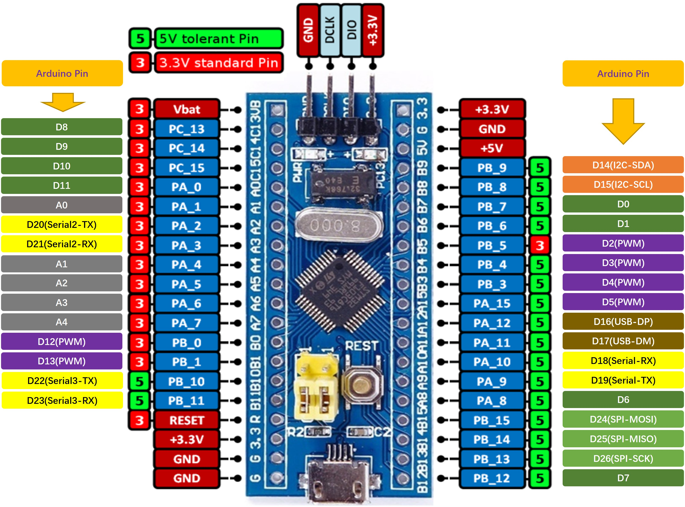

# The Arduino Compatible for STM32F103 Blue Pill Board

**English** | [中文](README_zh.md)

## 1 RTduino - Arduino Ecosystem Compatibility Layer for RT-Thread

STM32 Blue Pill board has support [RTduino](https://github.com/RTduino/RTduino). Users can use Arduino APIs, third party libraries and programming method to program on the board.

### 1.1 How to Enable RTduino

Please go to the [RTduino repository](https://github.com/RTduino/RTduino) to see the details.

```Kconfig
Hardware Drivers Config --->
    Onboard Peripheral Drivers --->
        [*] Compatible with Arduino Ecosystem (RTduino)
```

## 2 Arduino Pinout



| Arduino Pin         | STM32 Pin | 5V Tolerate | Note                                                                                                        |
| ------------------- | --------- | ----------- | ----------------------------------------------------------------------------------------------------------- |
| 0 (D0)              | PB7       | Yes         |                                                                                                             |
| 1 (D1)              | PB6       | Yes         |                                                                                                             |
| 2 (D2)              | PB5       | No          | PWM3-CH2. Token over by RT-Thread PWM device by default                                                     |
| 3 (D3)              | PB4       | Yes         | PWM3-CH1. Token over by RT-Thread PWM device by default                                                     |
| 4 (D4)              | PB3       | Yes         | PWM2-CH2. Token over by RT-Thread PWM device by default                                                     |
| 5 (D5)              | PA15      | Yes         | PWM2-CH1. Token over by RT-Thread PWM device by default                                                     |
| 6 (D6)              | PA8       | Yes         |                                                                                                             |
| 7 (D7, SS)          | PB12      | Yes         | SPI chip select by default                                                                                  |
| 8 (D8, LED_BUILTIN) | PC13      | No          | Build-in LED                                                                                                |
| 9 (D9)              | PC14      | No          |                                                                                                             |
| 10 (D10)            | PC15      | No          |                                                                                                             |
| 11 (D11)            | PA0       | No          |                                                                                                             |
| 12 (D12)            | PB0       | No          | PWM3-CH3. Token over by RT-Thread PWM device by default                                                     |
| 13 (D13)            | PB1       | No          | PWM3-CH4. Token over by RT-Thread PWM device by default                                                     |
| 14 (D14)            | PB9       | Yes         | I2C-SDA. Token over by RT-Thread I2C device by default                                                      |
| 15 (D15)            | PB8       | Yes         | I2C-SCL. Token over by RT-Thread I2C device by default                                                      |
| 16 (D16)            | PA12      | Yes         | USB-DP. Token over by [TinyUSB](https://github.com/RT-Thread-packages/tinyusb) software package by default. |
| 17 (D17)            | PA11      | Yes         | USB-DM. Token over by [TinyUSB](https://github.com/RT-Thread-packages/tinyusb) software package by default. |
| 18 (D18)            | PA10      | Yes         | Serial-Rx. Token over by RT-Thread UART device by default                                                   |
| 19 (D19)            | PA9       | Yes         | Serial-Tx. Token over by RT-Thread UART device by default                                                   |
| 20 (D20)            | PA2       | No          | Serial2-Tx. Token over by RT-Thread UART device by default                                                  |
| 21 (D21)            | PA3       | No          | Serial2-Rx. Token over by RT-Thread UART device by default                                                  |
| 22 (D22)            | PB10      | Yes         | Serial3-Tx. Token over by RT-Thread UART device by default                                                  |
| 23 (D23)            | PB11      | Yes         | Serial3-Rx. Token over by RT-Thread UART device by default                                                  |
| 24 (D24)            | PB15      | Yes         | SPI-MOSI. Token over by RT-Thread SPI device by default                                                     |
| 25 (D25)            | PB14      | Yes         | SPI-MISO. Token over by RT-Thread SPI device by default                                                     |
| 26 (D26)            | PB13      | Yes         | SPI-SCK. Token over by RT-Thread SPI device by default                                                      |
| 27 (A0)             | PA1       | No          | ADC1-CH1. Token over by RT-Thread ADC device by default                                                     |
| 28 (A1)             | PA4       | No          | ADC1-CH4. Token over by RT-Thread ADC device by default                                                     |
| 29 (A2)             | PA5       | No          | ADC1-CH5. Token over by RT-Thread ADC device by default                                                     |
| 30 (A3)             | PA6       | No          | ADC1-CH6. Token over by RT-Thread ADC device by default                                                     |
| 31 (A4)             | PA7       | No          | ADC1-CH7. Token over by RT-Thread ADC device by default                                                     |
| 32 (A5)             | --        |             | ADC of chip internal reference voltage. Token over by RT-Thread ADC device by default                       |
| 33 (A6)             | --        |             | ADC of chip internal temperature. Token over by RT-Thread ADC device by default                             |

> Notice:
> 
> 1. If you drive the servo and call the analogWrite function at the same time, you need to select the PWM signal pins generated by different timers. Since the 4 channels of the STM32 timer need to maintain the same frequency, if the PWM generated by the same timer is used to drive the servo and analogWrite respectively , it may cause the servo to fail.
> 2. More information about Arduino pinout, please see [pins_arduino.c](pins_arduino.c) and [pins_arduino.h](pins_arduino.h)

## 3 Communication

### 3.1 I2C Bus

I2C bus is `D14` and `D15` pins. Users can directly include the `#include <Wire.h>`, which is the Arduino official I2C header file, to use the I2C bus.

### 3.2 SPI Bus

SPI bus is `D24`, `D25` and `D26` pins. Users can directly include the `#include <SPI.h>`, which is the Arduino official SPI header file, to use the SPI bus. In addition, chip select pin (SS) also is used, which is `D7` by default.

### 3.3 Serial

This board supports to use `Serail.` method to operate `uart1` device; use `Serial2.` method to use `uart2` device; use `Serial3.` method to use `uart3` device. See [example](https://github.com/RTduino/RTduino/blob/master/examples/Basic/helloworld.cpp).

### 3.4 USB Virtual Serial

This board supports USB virtual serial. See [example](https://github.com/RTduino/RTduino/tree/master/examples/USBSerial). You may enable it if is needed.

```Kconfig
RT-Thread online packages --->
    Arduino libraries --->
        [*] RTduino: Arduino Ecological Compatibility Layer
            [*] Enable USB Serial
```
