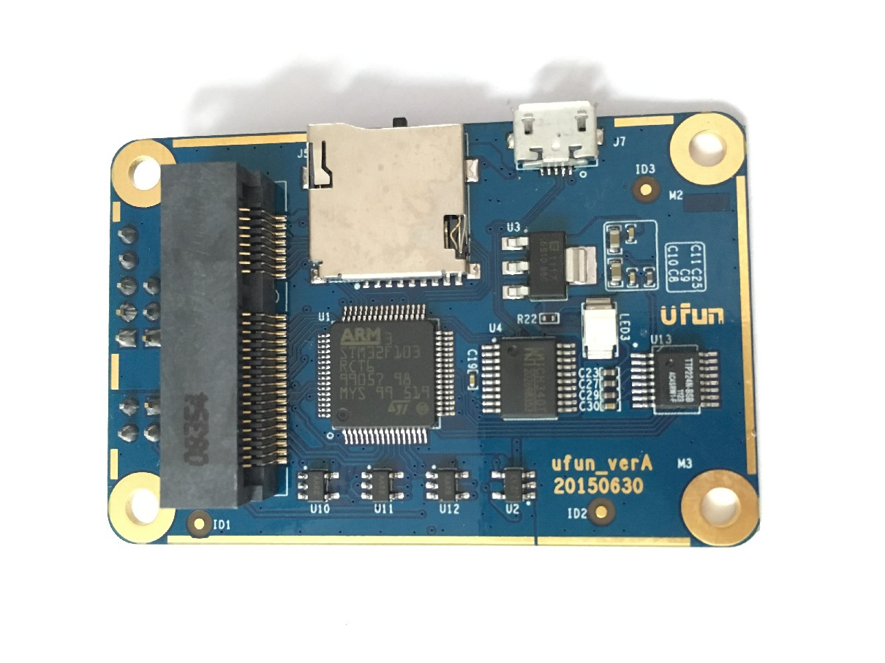

# STM32F103 yf-ufun 开发板 BSP 说明

## 简介

本文档为刘恒为 STM32F103 yf-ufun 开发板提供的 BSP (板级支持包) 说明。

主要内容如下：

- 开发板资源介绍
- BSP 快速上手
- 进阶使用方法

通过阅读快速上手章节开发者可以快速地上手该 BSP，将 RT-Thread 运行在开发板上。在进阶使用指南章节，将会介绍更多高级功能，帮助开发者利用 RT-Thread 驱动更多板载资源。

## 开发板介绍

yf-ufun STM32F103 是优凡（天津）科技有限公司推出的一款基于 ARM Cortex-M3 内核的开发板，最高主频为 72Mhz，该开发板具有丰富的板载资源，可以充分发挥 STM32F103 的芯片性能。正面有 Micro SD 卡槽，usb 接口（供电、ISP 下载、USB 转串口），LED，触摸按键控制芯片 TTP224N-BSB，CH340 USB 转串口芯片。背面有电源开关，BOOT 配置拨码开关，蜂鸣器，RGB LED，RTC 超级电容，复位按键，触摸按键，SWD 调试接口。通过 miniPCIe 连接扩展板。

开发板外观如下图所示：



该开发板常用 **板载资源** 如下：

- MCU：STM32F103RCT6，主频 72MHz，256KB FLASH ，48KB RAM
- 常用外设
  - LED：2个，LED3（R，PA3），LED1（RGB，PA1，PA2，PA0）
  - 按键：5个，K1 复位，上下左右4个触摸按键
- 常用接口：USB 转串口、SD 卡接口，miniPCIe 扩展接口等
- 调试接口，标准 SWD 调试下载接口

开发板更多详细信息请参考优凡 [ufun 资料] 链接:  https://pan.baidu.com/s/12WzPnuGVufoiKUtzhdXNeg 提取码:  mp4h

## 外设支持

本 BSP 目前对外设的支持情况如下：

| **板载外设**      | **支持情况** | **备注**                             |
| :----------------- | :----------: | :------------------------------------|
| USB 转串口        |     支持     |                                       |
| 蜂鸣器            |   支持   |                                       |
| LED               |     支持     |                                       |
| RGB LED           |   支持   |                                       |
| 触摸按键          |   暂不支持   |                                       |
| **片上外设**      | **支持情况** | **备注**                              |
| GPIO              |     支持     | PA0-PA14，PB0-PB15，PC0-PC5，PC7-PC12 |
| UART              |     支持     | UART1                                 |
| SPI               |   支持   | SPI1 |
| I2C               |   支持   | 软件 I2C |
| SDIO              |   支持   |                                       |
| RTC               |   暂不支持   |                                       |
| PWM               |   支持   |                                       |
| USB Device        |   暂不支持   |                                       |
| USB Host          |   暂不支持   |                                       |
| IWG               |   暂不支持   |                                       |
| **扩展模块**      | **支持情况** | **备注**                              |

## 使用说明

使用说明分为如下两个章节：

- 快速上手

    本章节是为刚接触 RT-Thread 的新手准备的使用说明，遵循简单的步骤即可将 RT-Thread 操作系统运行在该开发板上，看到实验效果 。

- 进阶使用

    本章节是为需要在 RT-Thread 操作系统上使用更多开发板资源的开发者准备的。通过使用 ENV 工具对 BSP 进行配置，可以开启更多板载资源，实现更多高级功能。

### 快速上手

本 BSP 为开发者提供 MDK4、MDK5 和 IAR 工程，并且支持 GCC 开发环境。下面以 MDK5 开发环境为例，介绍如何将系统运行起来。

#### 硬件连接

使用数据线连接开发板到 PC，打开电源开关。

#### 编译下载

双击 project.uvprojx 文件，打开 MDK5 工程，编译并下载程序到开发板。

> 工程默认配置使用 Jlink 仿真器下载程序，在通过 Jlink 连接开发板的基础上，点击下载按钮即可下载程序到开发板

#### 运行结果

下载程序成功之后，系统会自动运行，LED3 闪烁。

连接开发板对应串口到 PC , 在终端工具里打开相应的串口（115200-8-1-N），复位设备后，可以看到 RT-Thread 的输出信息:

```
 \ | /
- RT -     Thread Operating System
 / | \     4.0.2 build May 23 2019
 2006 - 2019 Copyright by rt-thread team
msh >
```

### 进阶使用

此 BSP 默认只开启了 GPIO 和 串口1 的功能，如果需使用 Flash 等更多高级功能，需要利用 ENV 工具对BSP 进行配置，步骤如下：

1. 在 bsp 下打开 env 工具。

2. 输入`menuconfig`命令配置工程，配置好之后保存退出。

3. 输入`pkgs --update`命令更新软件包。

4. 输入`scons --target=mdk4/mdk5/iar` 命令重新生成工程。

本章节更多详细的介绍请参考 [STM32 系列 BSP 外设驱动使用教程](../docs/STM32系列BSP外设驱动使用教程.md)。

## 注意事项

## 联系人信息

维护人:

-  [刘恒](https://github.com/lhxzui), 邮箱：<iuzxhl@qq.com>
