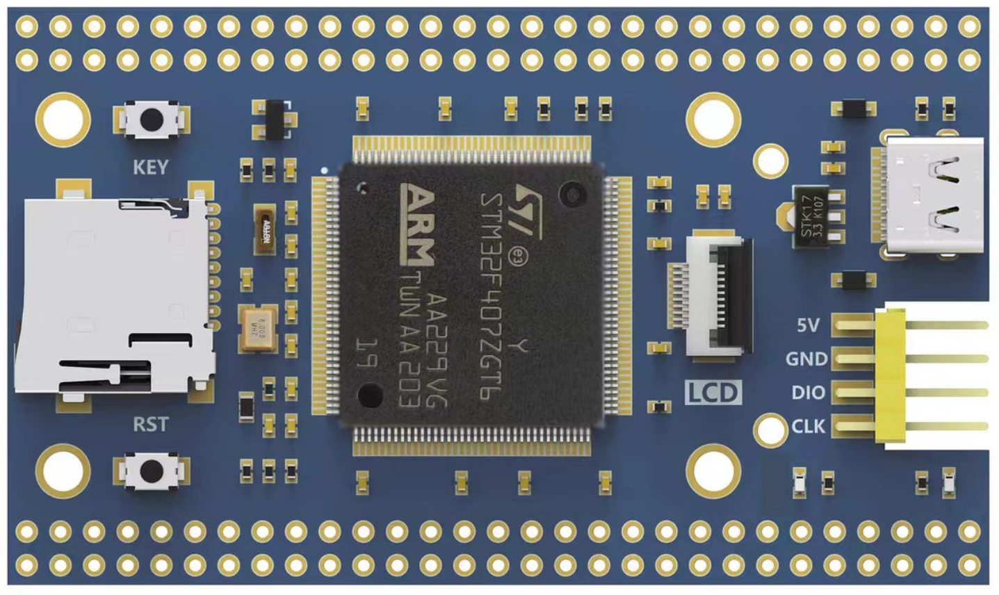

# FANKE F407M2-ZGT6 开发板 BSP 说明

## 简介

本文档为 FANKE F407M2-ZGT6 开发板的 BSP (板级支持包) 说明。

主要内容如下：

- 开发板资源介绍
- BSP 快速上手
- 进阶使用方法

通过阅读快速上手章节开发者可以快速地上手该 BSP，将 RT-Thread 运行在开发板上。在进阶使用指南章节，将会介绍更多高级功能，帮助开发者利用 RT-Thread 驱动更多板载资源。

## 开发板介绍

FK750M1-VBT6 是 FANKE 推出的一款基于 ARM Cortex-M4 内核的核心板，最高频率为168Mhz，具有512KB ROM、192KB RAM。

开发板外观如下图所示：



该开发板常用 **板载资源** 如下：

- MCU：STM32F407ZGT6，主频 168MHz，512KB FLASH ，192KB RAM
- 常用外设
  - LED：2个，电源LED（白色，电源指示），用户LED（蓝色，PC13）
  - 按键：2个，KEY（PA0），RST（nRST）
- 常用接口：USB 接口（Type-C）、TF 卡接口（自弹式 Micro SD卡接口）、LCD 接口（FPC 0.5间距）等
- 调试接口：SWD+串口

开发板更多详细信息请参考【厂商名】 [xxx开发板介绍](https://xxx)。

## 外设支持

本 BSP 目前对外设的支持情况如下：

| **板载外设**      | **支持情况** | **备注**                              |
| :----------------- | :----------: | :------------------------------------- |
| TF卡            |   暂不支持   |  |
| 0.96' LCD | 暂不支持 | 160*80 |
| 1.14' LCD | 暂不支持 | 240*135 |
| 1.30' LCD | 暂不支持 | 240*240 |
| 1.54' LCD | 暂不支持 | 240*240 |
| 1.69' LCD | 暂不支持 | 240*280 |
| 2.00' LCD | 暂不支持 | 240*320 |
| **片上外设**      | **支持情况** | **备注**                              |
| GPIO              |     支持     |  |
| UART              |     支持     | USART1~6 DMA Support |
| timer | 支持 | TIM11 TIM13 TIM14 |
| PWM | 支持 | TIM2 |
| on-Chip FLASH | 支持 |  |
| soft SPI BUS | 支持 | SPI1 SPI2 |
| SPI BUS | 支持 | SPI1 SPI2 DMA Support |
| ADC | 支持 | ADC1 |
| soft I2C BUS  |   支持   | I2C1 I2C2 |
| DAC | 支持 | DAC1 |
| RTC | 支持 | |
| Watchdog Timer | 支持 | |
| SDIO | 支持 | |
| USB Device        |   支持   |                               |
| USB Host | 支持 | |
| Pulse Encoder | 支持 | |
| RNG | 支持 | Random Number Generator |
| UDID | 支持 | Unique Device Identifier |

## 使用说明

使用说明分为如下两个章节：

- 快速上手

    本章节是为刚接触 RT-Thread 的新手准备的使用说明，遵循简单的步骤即可将 RT-Thread 操作系统运行在该开发板上，看到实验效果 。

- 进阶使用

    本章节是为需要在 RT-Thread 操作系统上使用更多开发板资源的开发者准备的。通过使用 ENV 工具对 BSP 进行配置，可以开启更多板载资源，实现更多高级功能。


### 快速上手

本 BSP 为开发者提供 MDK4、MDK5 和 IAR 工程，并且支持 GCC 开发环境。下面以 MDK5 开发环境为例，介绍如何将系统运行起来。

#### 硬件连接

将开发板的调试接口（SWD+USART1）连接至DAP-Link等调试器后，将调试器连接至PC。

#### 编译下载

双击 project.uvprojx 文件，打开 MDK5 工程，编译并下载程序到开发板。

> 工程默认配置使用 PWLINK2 Lite（DAP-Link） 仿真器下载程序，在通过 SWD 与 串口 连接开发板的基础上，点击下载按钮即可下载程序到开发板

#### 运行结果

下载程序成功之后，系统会自动运行，LED闪烁。

连接开发板对应串口到 PC , 在终端工具里打开相应的串口（115200-8-1-N），复位设备后，可以看到 RT-Thread 的输出信息:

```bash
 \ | /
- RT -     Thread Operating System
 / | \     5.0.0 build Mar 22 2023 00:10:44
 2006 - 2022 Copyright by RT-Thread team
msh />
```
### 进阶使用

此 BSP 默认只开启了 GPIO 和 串口1 的功能，如果需使用 SD 卡、Flash 等更多高级功能，需要利用 ENV 工具对BSP 进行配置，步骤如下：

1. 在 bsp 下打开 env 工具。

2. 输入`menuconfig`命令配置工程，配置好之后保存退出。

3. 输入`pkgs --update`命令更新软件包。

4. 输入`scons --target=mdk4/mdk5/iar` 命令重新生成工程。

本章节更多详细的介绍请参考 [STM32 系列 BSP 外设驱动使用教程](../docs/STM32系列BSP外设驱动使用教程.md)。

## 注意事项

- 目前仅测试 V1.1 版本硬件，较老的 V1.0 暂未测试

## 联系人信息

维护人:

-  Github: [sendu2wfdx](https://github.com/sendu2wfdx)
-  邮箱：<2508041672@qq.com>