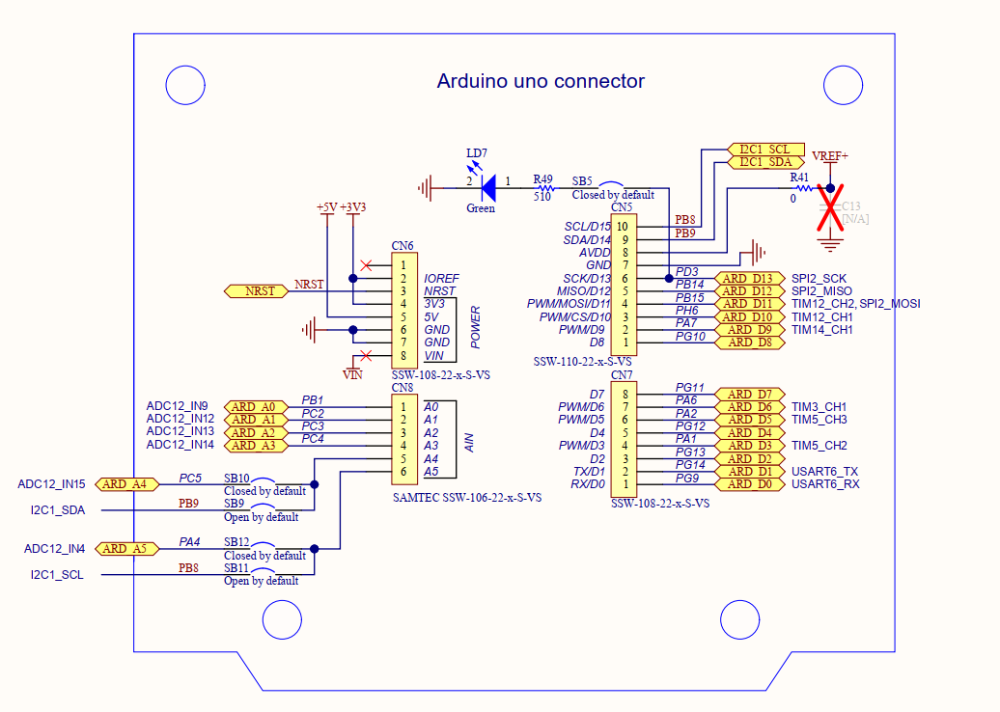

# The Arduino Compatible for STM32F469 Discovery Board

**English** | [中文](README_zh.md)

## 1 RTduino - Arduino Ecosystem Compatibility Layer for RT-Thread

STM32F469 Discovery board has support [RTduino](https://github.com/RTduino/RTduino). Users can use Arduino APIs, third party libraries and programming method to program on the board.

### 1.1 How to Enable RTduino

Please go to the [RTduino repository](https://github.com/RTduino/RTduino) to see the details.

```Kconfig
Hardware Drivers Config --->
    Onboard Peripheral Drivers --->
        [*] Compatible with Arduino Ecosystem (RTduino)
```

## 2 Arduino Pinout



This board complies with Arduino UNO pins layout. For more details, please take a look at: [pins_arduino.c](pins_arduino.c) and [pins_arduino.h](pins_arduino.h).

| Arduino Pin | STM32 Pin | 5V Tolerate | Note                                                                                         |
| ----------- | --------- | ----------- | -------------------------------------------------------------------------------------------- |
| 0 (D0)      | PG9       | Yes         | Serial-Rx. Token over by RT-Thread UART device by default                                    |
| 1 (D1)      | PG14      | Yes         | Serial-Tx. Token over by RT-Thread UART device by default                                    |
| 2 (D2)      | PG13      | Yes         |                                                                                              |
| 3 (D3)      | PA1       | Yes         | PWM2-CH2. Token over by RT-Thread PWM device by default                                      |
| 4 (D4)      | PG12      | Yes         |                                                                                              |
| 5 (D5)      | PA2       | Yes         | PWM2-CH3. Token over by RT-Thread PWM device by default                                      |
| 6 (D6)      | PA6       | Yes         | PWM3-CH1. Token over by RT-Thread PWM device by default                                      |
| 7 (D7)      | PG11      | Yes         |                                                                                              |
| 8 (D8)      | PG10      | Yes         |                                                                                              |
| 9 (D9)      | PA7       | Yes         | PWM3-CH2. Token over by RT-Thread PWM device by default                                      |
| 10 (D10)    | PH6       | Yes         | PWM12-CH1. Token over by RT-Thread PWM device by default                                     |
| 11 (D11)    | PB15      | Yes         | PWM12-CH2. Token over by RT-Thread PWM device by default                                     |
| 12 (D12)    | PB14      | Yes         |                                                                                              |
| 13 (D13)    | PD3       | Yes         | LED_BUILTIN                                                                                  |
| 14 (D14)    | PB9       | Yes         | I2C1-SDA. Token over by RT-Thread I2C device by default                                      |
| 15 (D15)    | PB8       | Yes         | I2C1_SCL. Token over by RT-Thread I2C device by default                                      |
| 16 (D16)    | PA0       | Yes         | USER Button                                                                                  |
| 17（D17）     | PG6       | Yes         | USER LED1                                                                                    |
| 18（D18）     | PD4       | Yes         | USER LED2                                                                                    |
| 19（D19）     | PD5       | Yes         | USER LED3                                                                                    |
| 20（D20）     | PK3       | Yes         | USER LED4                                                                                    |
| A0          | PB1       | Yes         | ADC1-CH9. Token over by RT-Thread ADC device by default                                      |
| A1          | PC2       | Yes         | ADC1-CH12. Token over by RT-Thread ADC device by default                                     |
| A2          | PC3       | Yes         | ADC1-CH13. Token over by RT-Thread ADC device by default                                     |
| A3          | PC4       | Yes         | ADC1-CH14. Token over by RT-Thread ADC device by default                                     |
| A4          | PC5       | Yes         | ADC1-CH15. Token over by RT-Thread ADC device by default                                     |
| A5          | PA4       | Yes         | ADC1-CH4. Token over by RT-Thread ADC device by default                                      |
| A6          | --        |             | On-chip internal temperature sensor ADC1-CH17. Token over by RT-Thread ADC device by default |
| A7          | --        |             | On-chip internal voltage sensor ADC1-CH16. Token over by RT-Thread ADC device by default     |

> References
> 
> 1. [STM32F469 Discovery ST Website](https://www.st.com/en/evaluation-tools/32f469idiscovery.html#documentation)

## 3 Communication

### 3.1 I2C Bus

I2C bus is `SCL/D15` and `SDA/D14` pins. Users can directly include the `#include <Wire.h>`, which is the Arduino official I2C header file, to use the I2C bus.

### 3.2 SPI Bus

This board doesn't support Arduino SPI header file and functions.

### 3.3 Serial

This board supports to use `Serail.` method to operate `uart2` device. See [example](https://github.com/RTduino/RTduino/blob/master/examples/Basic/helloworld.cpp).

### 3.4 USB Virtual Serial

This board supports USB virtual serial. See [example](https://github.com/RTduino/RTduino/tree/master/examples/USBSerial). You may enable it if is needed.

```Kconfig
RT-Thread online packages --->
    Arduino libraries --->
        [*] RTduino: Arduino Ecological Compatibility Layer
            [*] Enable USB Serial
```
