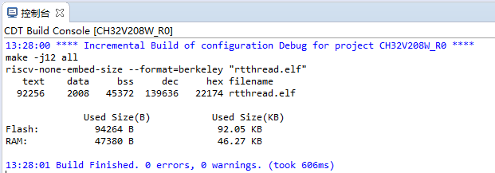
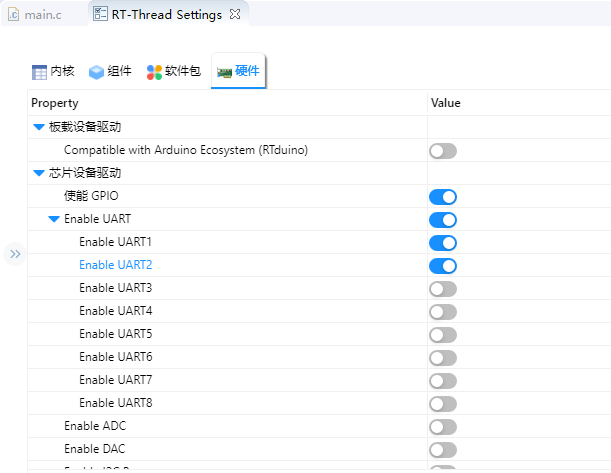
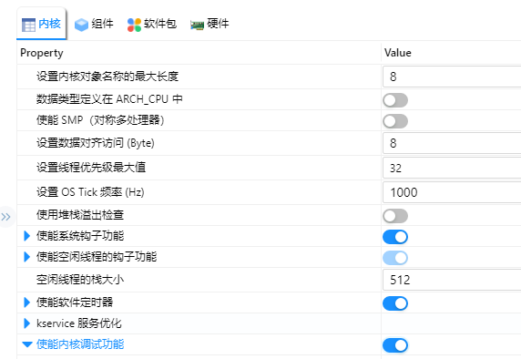
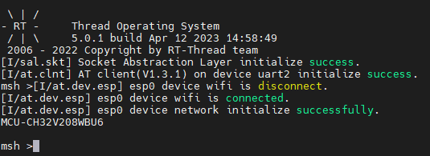
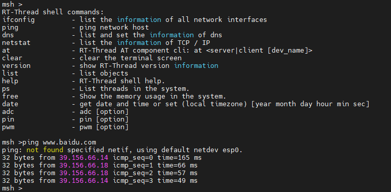
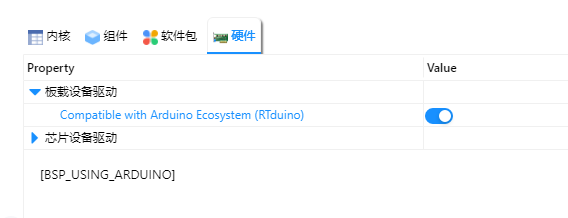

# CH32V208W-R0上手指南

**中文** | [English]()

CH32V208W-R0支持RT-Studio工程，本上手指南以RT-Studio环境的开发说明举例。

## 1 准备阶段

- 拉取rt-thread的github仓库到本地，[链接地址](https://github.com/RT-Thread/rt-thread)。

- 下载安装RT-Thread Studio,[链接地址](https://www.rt-thread.org/studio.html)。
- 准备ESP8266模块。

## 2 BSP上手阶段

### 2.1 点击文件，选择导入选项。


### 2.2 选择导入RT-Thread Bsp 到工作空间中


<div STYLE="page-break-after: always;"></div>

### 2.3 按照示例填写工程信息


### 2.4 配置工程

导入工程后，在工程的根目录下存在参考文档readme,首先按照readme.md进行基础的配置

为了减小链接时添加的标准库带来的内存增大，我们可以选择使用相对占用内存较小的newlib,具体操作如下：


### 2.5 编译工程

点击编译选项：


编译结果：



工程编译通过，至此，准备阶段完成。

## 3 使用RT-Studio配置BSP驱动

RT-Thread每个BSP已经默认适配了若干片上外设驱动与板载外设驱动，使用RT-Studio将相应的开关直接打开并依据使用环境配置相应参数即可使用。由于各个管脚存在复用功能，所以并不是所有的片上外设驱动与板载外设驱动都可以同时使用，使用时需要结合原理图来合理开启相应的外设驱动。

RT-Thread有许多软件软件包，使用RT-Studio将相应软件包的开关打开便可将软件包添加至工程使用。


## 4 联网实操：使用ESP8266模块联网

ESP8266是面向物联网应用的高性价比、高度集成的 Wi-Fi MCU,也可以将其作为一个单独的WIFI模块使用,其实物图如下。ESP8266模组通常支持[AT指令](https://www.rt-thread.org/document/site/#/rt-thread-version/rt-thread-standard/programming-manual/at/at)的操作方式，RT-Thread针对这些支持AT指令的模组提供了一个抽象层,本小结将使用AT组将与ESP8266通讯并连接WIFI。


### 4.1 配置板载UART外设

使用AT组件与ESP8266模组通讯采用串口通讯的方式，所以需要再使能一路串口，这里我们使用UART2，串口驱动默认已经支持，我们仅需要在使用时在RT-Studio中打开即可，具体操作方式如下:



开启选项后，`ctrl + s`保存设置，串口2即被初始化。

### 4.2 使用RT-Studio配置AT组件

点击左侧的RT-Thread Settings选项，弹出右侧的配置菜单，在搜索栏中输入AT,选择`AT设备 `，使能AT设备：


选择ESP8266，并配置相应参数，示例如下:


### 4.3 ESP8266模组连接

将板子上的`PA2`管脚与模组的`RX`管脚连接，将`PA3`管脚与模组的`TX`管脚连接，并使用开发板引出的电源为模组供电。


### 4.4 使能内核调试功能。

为了更加直观的了解组件的初始化过程，我们可以使能内核调试功能来观察(不需要时可以关掉)，操作方法如下：



重新编译并烧录固件，shell输出如下：




### 4.5 wifi联网测试

我门在使用AT时已经配置了WIFI的ID与密码，在shell中输入`ping www.baidu.com`命令测试WIFI连接情况。



输出类似内容，ESP8266模组便联网成功！

### 5 RTduino组件

[RTduino](https://github.com/Yaochenger/RTduino)是RT-Thread实时操作系统的Arduino生态兼容层，为[RT-Thread社区](https://github.com/RT-Thread/rt-thread)的子社区、Arduino开源项目的下游项目，旨在兼容Arduino社区生态来丰富RT-Thread社区软件包生态（如上千种分门别类的Arduino库，以及Arduino社区优秀的开源项目），并降低RT-Thread操作系统以及与RT-Thread适配的芯片的学习门槛。

#### 5.1 配置RTduino

将板载设备驱动中的RTduino选项打开。



开启选项后，`ctrl + s`保存设置，RTduino软件包即可添加至工程。

#### 5.2 使用RTduino

在`arduino_main.cpp`中会看到熟悉的`void setup(void)`与`void loop(void)`,至此我们便可以在此像使用arduino官方板一样使用该BSP，示例代码如下：

```c++
#include <Arduino.h>

void setup(void)
 {
     /* put your setup code here, to run once: */
    pinMode(LED_BUILTIN, OUTPUT);
 }

void loop(void)
{
    /* put your main code here, to run repeatedly: */
    digitalWrite(LED_BUILTIN, !digitalRead(LED_BUILTIN));
    delay(100);
}

```

 工程默认执行一个LED闪烁的功能，ch32v208w-r0这款板子默认板载LED不与管脚直接连接，用户在使用LED时需要使用杜邦线手动将LED与控制管脚连接起来,现象如下图所示：


至此ch32v208w-r0的基础环境便搭建测试完毕！

