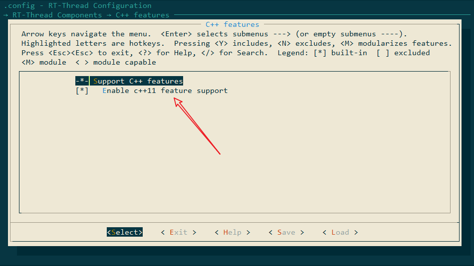

# C++ support for RT-Thread #

This is the C++ component in RT-Thread RTOS. In order to support C++ language, this component
implement a basic environment, such as new/delete operators.

Because RT-Thread RTOS is used in embedded system mostly, there are some rules for C++ applications:

1. DOES NOT use exception.
2. DOES NOT use Run-Time Type Information (RTTI).
3. Template is discouraged and it easily causes code text large.
4. Static class variables are discouraged. The time and place to call their constructor function could not be precisely controlled and make multi-threaded programming a nightmare.
5. Multiple inheritance is strongly discouraged, as it can cause intolerable confusion.

*NOTE*: The libc (RT_USING_LIBC in rtconfig.h) must be enable.

About GNU GCC compiler

please add following string in your ld link script:

    // in your .text section
    PROVIDE(__ctors_start__ = .);
    /* old GCC version uses .ctors */
    KEEP(*(SORT(.ctors.*)))
    KEEP(*(.ctors))
    /* new GCC version uses .init_array */
    KEEP (*(SORT(.init_array.*)))
    KEEP (*(.init_array))
    PROVIDE(__ctors_end__ = .);
    
    . = ALIGN(4);
    
    // as a standalone section if you use ARM target.
    
    /* The .ARM.exidx section is used for C++ exception handling. */
    /* .ARM.exidx is sorted, so has to go in its own output section.  */
    __exidx_start = .;
    ARM.exidx :
    {
        *(.ARM.exidx* .gnu.linkonce.armexidx.*)
    
        /* This is used by the startup in order to initialize the .data secion */
        _sidata = .;
    } > CODE
    __exidx_end = .;
    
    /* .data section which is used for initialized data */
    
    // in your .data section
    PROVIDE(__dtors_start__ = .);
    KEEP(*(SORT(.dtors.*)))
    KEEP(*(.dtors))
    PROVIDE(__dtors_end__ = .);
    
    . = ALIGN(4);

## How To Use

1. Enable c++11 support for rt-thread

   

2. Download toolchain GCC 10.2.1:

   ```shell
   gcc version 10.2.1 20201103 (release) (GNU Arm Embedded Toolchain 10-2020-q4-major)
   ```

3. Delete the following files:

   ```shell
   rm -f toolchain/arm-none-eabi/include/c++/10.2.1/thread
   rm -f toolchain/arm-none-eabi/include/c++/10.2.1/mutex
   rm -f toolchain/arm-none-eabi/include/c++/10.2.1/condition_variable
   rm -f toolchain/arm-none-eabi/include/c++/10.2.1/future
   rm -f toolchain/arm-none-eabi/include/pthread.h
   ```

4. Clear the contents of the following files and keep them to prevent compilation failures:

   ```shell
   toolchain/arm-none-eabi/include/sys/_pthreadtypes.h
   ```

